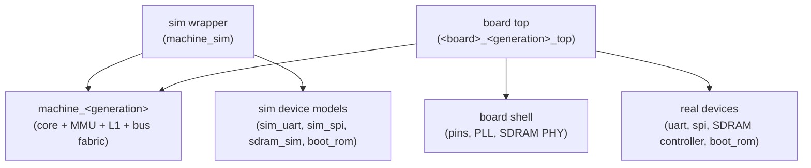

# Build & Test Structure

> **Applies to:** all generations · build infrastructure.

How the repository's build targets, RTL directory layout, and hardware
test suites are organized so that multiple CPU core generations,
multiple FPGA boards, and multiple execution platforms compose without
per-combination special cases. The Makefile implements this structure;
this document is its source of truth.

## The four axes

Every buildable or runnable hardware artifact is a point in a
four-axis matrix:

| Axis | Values | What it owns |
|------|--------|--------------|
| **Core generation** | `penumbra1`, `penumbra2`, … | `hw/rtl/<generation>/` — the CPU core modules |
| **Integration level** | core · machine | how much of the system surrounds the core |
| **Execution platform** | ISS · Verilator · FPGA | how the design executes |
| **Board** | `ulx3s`, … | constraints, pins, clocks, board-specific PHYs |

The axes are orthogonal by construction: adding a board must not touch
core directories, and adding a core generation must not touch board
directories. The ISA is the contract that makes this hold — every
generation runs the same binaries, so the ISS (which models the ISA,
not any core) and the conformance test programs are
generation-independent.

The two integration levels:

- **core** — the bare pipeline against a memory stand-in. Runs
  programs that need only the CPU and memory; used for bring-up and
  for synthesis timing probes that isolate core logic cones from
  system paths.
- **machine** — the core plus its generation-bound memory system and
  the shared bus fabric (see
  [the machine layer](#the-machine-layer)). Runs the full test suite.

## Directory layout

```
hw/rtl/
├── common/        ISA constants shared by every module (penumbra_pkg)
├── penumbra1/     gen1 core (microcoded)
├── penumbra2/     gen2 core (pipelined)
├── mmu/ soc/ io/ bus/   generation-neutral fabric and devices
├── machine/       machine integrations: machine_<generation>.sv
├── sim/           simulation-only models (sim_uart, unified_mem, …)
└── fpga/
    └── <board>/   board shell + per-(board, generation) top modules
```

A core generation directory contains only that core's modules, all
prefixed with the generation name. The fabric directories are shared
and must remain generation-neutral: a fabric module that needs
generation-specific behavior takes it through ports or parameters,
never by knowing which core is attached.

## The machine layer

`hw/rtl/machine/` hosts one integration module per generation,
`machine_<generation>`: the board-independent computer. It binds the
CPU core to its memory system (MMU, L1 caches, and the structures
between them) and the shared bus fabric, and exposes:

- the external Penumbra Bus, where devices attach;
- interrupt request inputs;
- commit/retire observability and the trace port;
- a **program-end pulse** for test runners.

Devices live *outside* the machine. Two kinds of wrapper instantiate
it:



Because both wrappers attach devices to the same bus the machine
exposes, what simulates is what synthesizes — the sim and FPGA
configurations differ only in device models and the board shell.

**The program-end contract.** Test programs end in `BREAK` and report
pass/fail in R1. Each machine exposes a program-end pulse whose
realization is generation-defined (a microcoded core may halt on
BREAK; a pipelined core that treats BREAK as a trap pulses on the
retiring BREAK op-class instead). In-order commit guarantees
architectural state is final when the pulse fires. A program runner
keys on this contract — clock, reset, program-end, R1 readback, trace
— and therefore serves any generation's machine unchanged.

## Test program taxonomy

Hardware test programs live in `hw/sim/programs/`, split by what they
verify — the directory is the contract, not the filename:

```
hw/sim/programs/
├── isa/           ISA conformance — must pass on the ISS and on
│                  every core generation's machine, unchanged
├── penumbra1/     gen1 microarchitecture regressions
└── penumbra2/     gen2 microarchitecture regressions
```

- **`isa/`** is the conformance suite. A new core generation is
  ISA-complete exactly when `isa/` passes on it unchanged. Programs
  here exercise architectural behavior (instructions, exceptions,
  traps, interrupts, MMU semantics) and never depend on
  implementation timing, cache geometry, or counter values.
- **`penumbra<N>/`** holds programs pinned to one implementation:
  pipeline-shaped hazard regressions, cache/arbiter timing, perfctr
  counts. These run only on their generation.

All programs keep the `test_` filename prefix, and basenames are
unique across suites — build artifacts and `make test-prog` are keyed
by basename, so the test driver rejects duplicates loudly rather than
let one program's results shadow another's. Per-program metadata goes
in the header comment as lit-style tags the test driver scans:

- `; RUNNER: tb_<name>` — run under a bespoke testbench instead of
  the generation's default program runner. Used when the testbench is
  part of the stimulus (e.g. driving an IRQ line at a precise point).
  `isa/` programs always use the default runner — a program that
  needs bespoke stimulus is implementation-pinned by definition and
  belongs in its generation directory.
- `; REQUIRES: <capability> …` — capabilities the executing
  integration must provide (lowercase tokens, e.g. `mmu`, `uart`).
  Each runner declares the set it provides in the test driver; a
  program whose requirements aren't met is reported as skipped, never
  silently dropped. Programs with no tag need only CPU + memory.

## Make targets

| Target | Meaning |
|--------|---------|
| `make test [CORE=<generation>]` | `isa/` + `<generation>/` programs on that generation's RTL runner (default `CORE=penumbra1`) |
| `make test-iss` | `isa/` on the ISS — the generation-independent ISA reference |
| `make test-prog CORE=<generation> PROG=<name>` | one program, porcelain for iteration |
| `make test-modules` | per-module Verilator testbenches (all generations registered in `MODULE_TESTS`) |
| `make test-all` | everything above |
| `make fpga BOARD=<board> CORE=<generation> [VARIANT=<v>]` | synthesize + PnR + bitstream |
| `make flash` / `make timing` | same variables as `fpga` |

`make sim MOD=<m> TB=<tb> PROG=<p>` remains the low-level escape
hatch beneath the porcelain, as `TOP=<module>` does for the FPGA flow.

The program-run loop lives in a script (`hw/tools/run-prog-tests.py`),
not in Makefile shell blocks: the Makefile resolves *which* programs
and *which* runner binary, the script owns tag scanning, execution,
and the pass/fail report.

## FPGA top naming and source composition

`BOARD` and `CORE` (plus optional `VARIANT`) expand mechanically to a
top module — one file per combination, no preprocessor-selected
instantiation:

```
TOP = <board>_<core>[_<variant>]_top      e.g. ulx3s_penumbra2_top
file: hw/rtl/fpga/<board>/<top>.sv
```

Each top file is thin: it instantiates the board shell (pins, PLL,
PHYs — shared per board) and one machine plus its devices. Variants
cover non-default integration levels — e.g. a `probe` variant wraps
the bare core for timing characterization without the fabric.
Explicit per-combination files keep every buildable configuration
greppable as a real module, and keep the RTL free of build-flag
conditionals — consistent with the discrete-logic principle that
"which machine this is" should be a schematic fact, not a flag.

The source set composes from per-axis variables; computed variable
names keep it table-driven:

```make
FPGA_SRC = $(SRC_COMMON) $(SRC_CORE_$(CORE)) $(SRC_FABRIC) $(SRC_BOARD_$(BOARD))
```

A variant may override the composition (the probe variant drops
`$(SRC_FABRIC)` and adds the memory stand-in). The Makefile carries
one registry table mapping each valid (board, core, variant) tuple to
its top and any source-set override; an invalid tuple is a hard
error, not a silently empty source list.
