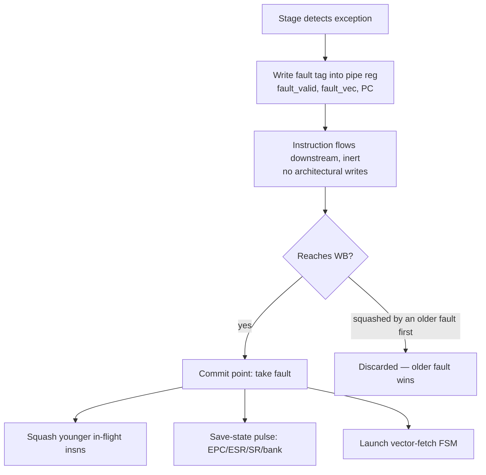

# Penumbra/2 — Exception Flow

This document specifies how the Penumbra/2 pipeline takes and
returns from exceptions, traps, and interrupts: where each fault is
detected, how precise exceptions are realised in an overlapped
pipeline, the hardware save-state pulse, the vector-fetch FSM, the
`ERET` return path, and interrupt recognition (`SR.I`, `ei_shadow`,
`EI`/`DI`). It is the reference for implementing the fault path in
`if_stage.sv`, `ex_stage.sv`, `mem_stage.sv`, and `wb_stage.sv`.

The **ISA-level contract** — vector table, SPR semantics, SR bit
layout, entry/exit effects — is defined for gen1 in
[`doc/system/architecture.md`](../../system/architecture.md)
§ Exception Model and § Interrupt Control, and gen2 matches it
exactly (the same NetBSD kernel boots on both). This doc does not
re-decide any ISA-visible behavior; it specifies the **gen2
mechanism** that produces that behavior in a 6-stage pipeline. Where
it recaps the contract it cites the gen1 spec as authoritative.

## Scope

Covered:

- The ISA contract recap (vector table, SPRs, SR, entry/exit).
- Which pipeline stage detects each exception source.
- Precise exceptions: fault-bit propagation and commit at WB.
- The one-cycle save-state pulse and its scoreboard bypass.
- The vector-fetch FSM in IF.
- `ERET` as a drain-commit instruction.
- Interrupt recognition: `SR.I`, the `ei_shadow` delay, `EI`/`DI`,
  `EI; ERET` atomicity, the `EI; NOP; DI` window.
- Exception/trap/IRQ priority arbitration (Section 9 — open point).
- EPC classification (faulting-PC vs next-PC).

Out of scope:

- Scoreboard internals — see
  [hazard-model.md](./hazard-model.md). This doc supplies the three
  facts that doc forward-references (fault-commit squash, save-state
  scoreboard bypass, vector-fetch stall) and otherwise defers.
- MMU/TLB translation and the software miss handler's page-table
  walk — see [`mmu.md`](../../system/mmu.md). This doc covers only
  how an MMU fault enters the pipeline's exception path.
- Per-stage pipeline-register field lists — see
  [pipeline-stages.md](./pipeline-stages.md).

## 1. ISA contract recap (authoritative: gen1 spec)

These facts are fixed by the ISA; gen2 reproduces them.

### 1.1 Vector table

11 vectors (0–10) are defined; 11–15 are reserved. The table is 16
× 4 bytes at **physical** `0x0000_0000`; each entry is a 32-bit
**handler address** (MIPS/68k-style indirect, not an ARM-style
instruction slot). Vector fetch **bypasses the MMU**
([architecture.md](../../system/architecture.md) § Vector Table;
[mmu.md](../../system/mmu.md)).

| # | Addr | Name | Class | Source |
|--:|------|------|-------|--------|
| 0 | 0x00 | `VEC_BUS_FAULT` | fault | No device at accessed address |
| 1 | 0x04 | `VEC_TIMER` | interrupt | Timer (sysreg device 7) |
| 2 | 0x08 | `VEC_TLB_MISS` | fault | TLB miss |
| 3 | 0x0C | `VEC_TLB_PROT` | fault | TLB protection violation |
| 4 | 0x10 | `VEC_PRIV` | fault | Privilege violation |
| 5 | 0x14 | `VEC_SYSCALL` | trap | `SYSCALL` |
| 6 | 0x18 | `VEC_BREAK` | trap | `BREAK` |
| 7 | 0x1C | `VEC_ILLEGAL` | fault | Illegal instruction |
| 8 | 0x20 | `VEC_ALIGN` | fault | Misaligned fetch or data access |
| 9 | 0x24 | `VEC_EXT_IRQ` | interrupt | External device IRQ (wired-OR) |
| 10 | 0x28 | `VEC_ARITH` | fault | `DIV`/`DIVU` with `Rs = 0` (divide-by-zero) |

The three **classes** — fault, trap, interrupt — differ only in
what EPC holds (Section 1.4) and whether the source is synchronous
(faults, traps: tied to a specific instruction) or asynchronous
(interrupts: tied to a pipeline boundary).

### 1.2 SPRs

SPR numbers (`RDSPR`/`WRSPR`, encoded in IR[15:12]):

| # | SPR | Role at exception time |
|--:|-----|------------------------|
| 0 | ESR | `SR` snapshot saved on entry |
| 1 | EPC | PC saved on entry |
| 2 | USP | User stack pointer (banked R14) |
| 3 | SR | Current status register |
| 4–7 | SCR0–SCR3 | Supervisor scratch (TLB-miss spill slots) |

### 1.3 SR bit layout

```
 31  30  29 ............ 4   3   2   1   0
┌───┬───┬─── reserved 0 ───┬───┬───┬───┬───┐
│ S │ I │     0 … 0        │ V │ C │ Z │ N │
└───┴───┴──────────────────┴───┴───┴───┴───┘
```

S = supervisor (bit 31), I = interrupt-enable (bit 30), then the
NZCV flags in bits 3:0 (V, C, Z, N). Only the NZCV flags are
scoreboard-tracked; S and I are serialised by drain-commit — see
[hazard-model.md §7](./hazard-model.md#7-control-state-serialization-the-s-and-i-bits).

### 1.4 Entry and exit effects

On entry the hardware performs, atomically:

1. `EPC ← saved-PC`, `ESR ← SR`.
2. `SR.S ← 1`, `SR.I ← 0`.
3. R14 banks to SSP (supervisor stack pointer).
4. Read handler address from `vector_table[vec << 2]`, MMU bypassed.
5. `PC ← handler address`.

The **saved-PC** depends on class:

- **Faults** — the faulting instruction's own PC (the handler fixes
  the cause and retries). This is the precise-exception requirement.
- **Interrupts** — the PC of the next instruction that would have
  executed (the interrupted instruction stream completed up to a
  boundary).
- **Traps** (`SYSCALL`/`BREAK`) — see the EPC-classification note in
  Section 10; the gen1 ISA text and the gen1 microcode differ on
  whether EPC points at the trap instruction or the one after, and
  gen2 must match whatever the kernel's trap path expects.

`ERET` reverses entry: `SR ← ESR` (which may re-bank R14 if S
changes), then `PC ← EPC`. For a context switch to a *different*
process the kernel writes EPC/ESR with `WRSPR` first, then `ERET`
([architecture.md](../../system/architecture.md) § Exit Sequence).

## 2. Exception sources by detecting stage

In a pipeline each exception is detected in the stage that has the
information to detect it. The detecting stage does **not** act
immediately; it attaches a fault tag to the instruction's pipeline
register, and the fault is *taken* only if/when that instruction
reaches the commit point (Section 3). This is what makes the
exceptions precise.

| Vector | Detected in | How |
|--------|-------------|-----|
| `VEC_TLB_MISS`, `VEC_TLB_PROT` (fetch) | IF1/IF2 | I-side TLB lookup miss / protection bits on the fetch translation |
| `VEC_ALIGN` (fetch) | IF1 | PC not 4-aligned |
| `VEC_BUS_FAULT` (fetch) | IF2 | Fetch access to an unbacked physical address |
| `VEC_ILLEGAL` | ID / EX | Decoder finds no legal opcode/operand form |
| `VEC_PRIV` | ID / EX | Privileged op (`RDSPR`/`WRSPR`/`RDSYS`/`WRSYS`/`ERET`/`EI`/`DI`) issued with `SR.S = 0` |
| `VEC_ARITH` | EX | divmul raises divide-by-zero (`DIV`/`DIVU` with `Rs = 0`) |
| `VEC_TLB_MISS`, `VEC_TLB_PROT` (data) | MEM | D-side TLB lookup miss / protection bits on a load/store |
| `VEC_ALIGN` (data) | MEM | Load/store effective address misaligned for its width |
| `VEC_BUS_FAULT` (data) | MEM | Load/store to an unbacked physical address |
| `VEC_SYSCALL`, `VEC_BREAK` | EX | The trap instruction reaches EX |
| `VEC_EXT_IRQ`, `VEC_TIMER` | IF1 | Asynchronous — sampled at the fetch boundary (Section 8) |

Note the same vector (`VEC_TLB_MISS`, `VEC_ALIGN`, `VEC_BUS_FAULT`)
can be raised on either the **instruction** side (IF) or the **data**
side (MEM). The `FAULT_STATUS` sysreg's R/W/X bits tell the handler
which ([sysregs.md](../../system/sysregs.md)); the vector is the
same.

## 3. Precise exceptions in the pipeline

The central mechanism. Penumbra/2 completes strictly in program
order (back-pressure holds younger instructions behind older ones;
see [Decision 10](./design-decisions.md#10-stall-propagation-policy-back-pressure)),
which is what makes precise exceptions affordable.

### 3.1 Fault tags ride the pipeline registers

When a stage detects a synchronous exception, it does not redirect
control. It writes a **fault tag** into the instruction's outgoing
pipeline register:

- `fault_valid` — 1 bit, "this instruction has a pending exception."
- `fault_vec` — the vector number (Section 1.1).
- the instruction's `PC` (already carried for branch/EPC use).

The tagged instruction then flows downstream like any other, except
that a faulting instruction is **inert**: it performs no
architectural write (its regfile-write and SR-write enables are
gated off by `fault_valid`), so it cannot corrupt state on its way
to commit. A later stage may detect an *additional* condition on the
same instruction; Section 9 defines how the stage arbitrates which
vector survives.

### 3.2 Commit point: WB

The fault is **taken at WB** — the commit point — for the oldest
instruction carrying `fault_valid`. Because completion is in order,
"the instruction currently in WB" is always the oldest in flight, so
taking the fault there is automatically the precise choice: every
older instruction has already retired, and every younger instruction
is still in EX/MEM/ID/IF and has not committed.

Taking the fault at WB triggers three things in the same cycle:

1. **Fault-commit squash** of every younger in-flight instruction
   (those in IF1, IF2, ID, EX, MEM). They are forced to bubble at
   the next clock edge; none of them committed, so nothing is rolled
   back (see [hazard-model.md §11](./hazard-model.md#11-interaction-with-exception-entry)).
2. **The save-state pulse** (Section 4): EPC/ESR/SR/bank updates.
3. **The vector-fetch FSM** (Section 5) is launched in IF.



### 3.3 Why "oldest faulting instruction wins" is free

Two instructions can carry `fault_valid` at once (e.g., a faulting
load in MEM behind an illegal instruction in WB). The younger one
never commits its fault, because the older one's WB-commit squash
flushes it first. No explicit age comparison is needed — in-order
commit *is* the age order. This is the single most important
consequence of the in-order pipeline for the exception path.

## 4. The save-state pulse

Save-state is a **one-cycle parallel write** asserted by the
commit logic when a fault is taken at WB (or when an IRQ is taken,
Section 8). In that cycle, by **direct flop writes** (not through
the regfile write port, not through the scoreboard):

- `EPC ← saved_PC` (the committing instruction's PC for faults; the
  next-fetch PC for interrupts — Section 10).
- `ESR ← SR` (the *pre-entry* SR, capturing flags + S + I as they
  were).
- `SR.S ← 1`, `SR.I ← 0`.
- R14 bank select ← SSP.

All four happen in parallel in one cycle; there is no push/pop
sequence and therefore no microcode routine (this is what
[Decision 6](./design-decisions.md#6-control-architecture-pure-hardwired-no-microcode)
relies on — exception entry's only multi-step part is the vector
*fetch*, which is a tiny FSM, not a microprogram).

**Scoreboard bypass.** The direct writes to ESR and EPC do **not**
clear or set scoreboard valid bits. This is safe because save-state
fires only after the fault-commit squash has emptied the pipeline of
younger instructions, so no in-flight instruction can have ESR or
EPC as a pending destination at that moment
([hazard-model.md §3, §11](./hazard-model.md#3-valid-bit-lifecycle)).
The first kernel instruction that *reads* ESR/EPC (via `RDSPR`) does
so many cycles later, after the handler has been fetched.

## 5. The vector-fetch FSM

The handler address is an indirect load from the vector table, so
entry needs one memory access that the normal pipeline is not in a
position to issue (it has just been squashed). A small FSM in IF
performs it. It is the only sequential ("multi-cycle") part of
exception entry.

```mermaid
stateDiagram-v2
    [*] --> IDLE
    IDLE --> DRIVE: save-state pulse fired
    DRIVE --> WAIT: MAR ← vec<<2 (phys, MMU bypass)<br/>issue read
    WAIT --> WAIT: memory not ready
    WAIT --> LOAD: read data valid
    LOAD --> IDLE: PC ← data; resume normal IF
```



- **IDLE** — normal fetch; the FSM is dormant.
- **DRIVE** — entered the cycle after the save-state pulse. Drives
  the fetch address to `vec << 2` as a **physical** address with MMU
  translation bypassed, and issues the read. (Bypass is mandatory:
  the vector page must be reachable with no TLB entry, to avoid a
  recursive TLB miss on every exception.)
- **WAIT** — holds while the memory/cache returns the handler word.
  This is the "Vector-fetch in progress" stall listed in
  [pipeline-stages.md §Stall sources](./pipeline-stages.md#stall-sources);
  IF1 is held, and because the pipeline downstream was just squashed
  it is already empty, so nothing else needs to stall.
- **LOAD** — the handler address arrives; `PC ←` it; the FSM returns
  to IDLE and normal fetch resumes at the handler. No squash is
  needed on this transition — downstream is already empty
  ([pipeline-stages.md §Squash sources](./pipeline-stages.md#squash-sources),
  "Vector-fetch redirect").

The FSM consumes the vector number latched by the save-state pulse.
A nested exception during vector fetch cannot occur: interrupts are
masked (`SR.I = 0` was just set), the access is physical (no TLB
fault), and the vector page is backed (no bus fault) by system
construction.

## 6. ERET

`ERET` is a **drain-commit** instruction
([Decision 9](./design-decisions.md#9-drain-commit-primitive)). It
restores architectural state that older in-flight instructions must
be allowed to observe under the *old* SR, and that younger
instructions must observe under the *new* SR — so it cannot commit
until the pipeline ahead of it has drained.

Sequence:

1. `ERET` reaches EX and enters the drain-commit `DRAIN` state,
   back-pressuring IF/ID (they hold).
2. MEM and WB drain — any older instruction finishes and commits
   under the pre-`ERET` SR. (This is why `ERET` cannot commit early:
   a fault on an older load in MEM must save `ESR ← old SR`, not the
   post-`ERET` SR.)
3. With MEM/WB empty, `ERET` commits **in EX**: `SR ← ESR` (may
   re-bank R14 if S flips), then `PC ← EPC`.
4. `ERET` squashes IF1/IF2/ID (the speculatively-fetched
   fall-through instructions) and redirects fetch to EPC.

`ERET` has **0 cycles** post-commit wait — its effects are internal
to the CPU and observable the same cycle
([Decision 9](./design-decisions.md#9-drain-commit-primitive)
variant table). It writes no GPR and no scoreboard entry; the
SR-write is to the NZCV portion (scoreboard-tracked) plus S/I
(drain-serialised), consistent with
[hazard-model.md §9](./hazard-model.md#9-interaction-with-drain-commit).

## 7. SR.S quiescence (link to the hazard model)

Exception entry sets `SR.S = 1` and `ERET` restores it; both happen
at points where the pipeline is drained or squashed of younger
instructions. This is what gives the ID-stage decoder a stable
`SR.S` to read when mapping architectural R14 to physical USP/SSP.
The argument is developed in
[hazard-model.md §7.3](./hazard-model.md#73-srs-quiescence-for-the-decoders-r14-mapping);
this doc is the other half of it — the place where S actually
changes — and confirms that every S-change is fenced by a
drain (ERET) or a squash-and-drain (exception entry).

## 8. Interrupts

Interrupts (`VEC_TIMER`, `VEC_EXT_IRQ`) are **asynchronous**: not
tied to any instruction. They are recognised at the fetch boundary
and taken by *drain-and-take*.

### 8.1 Masking and recognition

An IRQ is eligible to be recognised when `SR.I = 1` **and**
`ei_shadow = 0` (Section 8.3). The IF1 stage samples the wired-OR
IRQ inputs each cycle. Timer takes priority over the external IRQ
line when both are pending
([architecture.md](../../system/architecture.md) § Interrupt
sources).

### 8.2 Drain-and-take

When IF1 recognises an eligible IRQ:

1. IF1 **stops fetching** (the "IRQ drain-and-take" stall in
   [pipeline-stages.md §Stall sources](./pipeline-stages.md#stall-sources)).
2. The instructions already in flight (IF2, ID, EX, MEM, WB) are
   allowed to **drain and commit normally** — the interrupted stream
   completes up to a clean boundary. (Contrast with a fault, which
   *squashes* younger instructions. An interrupt is not anyone's
   fault, so nothing is discarded.)
3. Once the pipeline is empty, the save-state pulse fires with
   `EPC ← next-fetch PC` (the PC of the instruction that would have
   been fetched next — the boundary), `fault_vec ←` the IRQ's vector,
   and the vector-fetch FSM launches.

Because the in-flight instructions complete, an interrupt is
**precise** in the same sense as a fault: EPC names a clean
instruction boundary and no instruction is half-executed.

If an in-flight instruction *faults* during the drain, the fault
takes precedence (it commits at WB and squashes, including
cancelling the pending IRQ acceptance); the IRQ remains pending and
is recognised after the fault's handler eventually returns. Section
9 specifies the arbitration.

### 8.3 `ei_shadow`, EI, DI

The ISA mandates that `EI` enables interrupts with a **one-
instruction delay**: the instruction immediately after `EI` runs
with interrupts still masked
([architecture.md](../../system/architecture.md) § EI). `DI`
disables immediately. Both are privileged (user-mode use traps to
`VEC_PRIV`) and both are **drain-commit**
([hazard-model.md §7.4](./hazard-model.md#74-why-eidi-are-drain-commit-too)).

gen2 implements the delay with an `ei_shadow` flip-flop:

- `EI` commits (drain-commit): sets `SR.I = 1` **and** `ei_shadow = 1`.
- While `ei_shadow = 1`, IF1 suppresses IRQ recognition even though
  `SR.I = 1`.
- `ei_shadow` clears after the next instruction is fetched, so
  exactly one instruction runs in the shadow.

Because `EI` drain-commits, the pipeline is empty when it commits,
so "the next instruction" is unambiguously the single next fetch —
the shadow is **one architectural instruction deep regardless of
pipeline depth**. This makes two idioms work identically on gen1 and
gen2:

- **`EI; ERET`** — atomic enable-and-return. `ERET` runs in the
  shadow and redirects PC before any IRQ; the IRQ is then recognised
  at the returned-to context. Without the shadow, an IRQ could be
  taken between `EI` and `ERET`, corrupting the return.
- **`EI; NOP; DI`** — crack exactly one interrupt window at a safe
  point. The `NOP` runs in the shadow (masked); after it, `ei_shadow`
  is clear and `SR.I = 1`, so the IRQ is recognised at the fetch
  boundary *before* `DI`; then `DI` re-masks. Exactly one window,
  one `NOP`, on any pipeline depth.
- **`EI; DI`** (no instruction between) opens **no** window: the
  `DI` is the shadowed instruction and re-masks before the enable
  ever takes effect. This is correct delayed-EI behavior, not a bug.

`DI` drain-commits with immediate effect: once it commits, the
pipeline is drained, and the next fetched instruction sees `SR.I = 0`
— so no younger instruction can be interrupted after a `DI`.

## 9. Exception / trap / interrupt arbitration

When more than one exception condition is live, a single vector must
be chosen. Two independent questions:

- **Across instructions** — answered by in-order commit
  (Section 3.3): the oldest faulting instruction wins automatically,
  because it commits first and squashes the rest. No comparison
  logic.
- **Within one instruction / boundary** — a single instruction may
  satisfy more than one condition, and an asynchronous IRQ may be
  pending at the same boundary. This needs a defined order. gen1
  resolves it in microcode (`fault > illegal > priv > BREAK >
  SYSCALL > IRQ`, [microcode.md](../../internals/microcode.md));
  gen2 reproduces a consistent order.

### 9.1 Specified total order

The order in which a single vector is selected:

1. Address alignment
2. TLB fault
3. Bus error
4. Illegal instruction
5. Privilege violation
6. `BREAK`
7. `SYSCALL`
8. Timer (clock) interrupt
9. External (hardware) interrupt

This is the *specification* of the result — the vector the kernel
observes. It is **not** a description of one priority encoder over
nine conditions; Section 9.2 shows the realisation is mostly
structural.

### 9.2 How the order is realised: structure first, small muxes second

Most of the order falls out of *where and when* each condition is
detected, not from an encoder at the commit point. Because a fault
tag makes its instruction **inert** (Section 3.1), an
earlier-detected fault structurally precludes every later one on the
same instruction — the instruction never reaches the later stage to
raise them. So the bulk of the ranking costs no logic:

- **Fetch faults precede everything downstream.** An instruction
  that takes a fetch-side alignment/TLB/bus fault in IF is tagged
  inert and carries that vector to commit; it never decodes (so can
  never become illegal/priv) and never executes a memory access (so
  can never take a data fault). *An instruction cannot fault on both
  the I-side and the D-side* — the I-access happens first in IF1/IF2,
  and a fault there prevents any D-access.
- **Decode faults precede data faults.** An illegal or privileged
  instruction is tagged inert at ID/EX and never reaches MEM, so it
  raises no data alignment/TLB/bus fault. (An *illegal* instruction
  has no defined memory access to begin with.)
- **`BREAK` vs `SYSCALL`** never co-occur — distinct opcodes, no
  arbitration.
- **The IRQ is not a per-instruction condition.** It is arbitrated
  at the fetch boundary against whether a synchronous fault/trap is
  about to commit in the draining stream, and it sits lowest: a
  fault or trap is always taken first and the IRQ waits (stays
  pending, recognised after the handler returns). Consequence: *an
  instruction-stream fault is never lost to a coincident interrupt.*

What remains — conditions that genuinely *can* be simultaneously
true at one detection point, and therefore need a real priority mux
— is small:

| Local arbitration | Conditions | Order | Where |
|-------------------|-----------|-------|-------|
| Per-access fault | alignment, TLB, bus | align > TLB > bus | once on the IF fetch path, once on the MEM data path |
| Decode fault | illegal, priv | illegal > priv | ID / EX |

Alignment is ranked ahead of translation because a misaligned
address cannot be meaningfully translated. Each is a tiny
fixed-priority mux over local detect signals — stateless,
combinational, no global commit-point encoder.

**Wired-directly vs behind-a-mux is an RTL-time call.** Several
vectors have exactly one source (`VEC_ARITH` from divmul; the traps
from their opcodes) and need no arbitration — they can be carried
straight to commit. The total order in 9.1 is the contract; the
partition between "vector wired directly from its sole detection
point" and "vector selected by a local mux" is decided when the
stages are written, not mandated here.

## 10. EPC classification (faulting-PC vs next-PC)

Each instruction carries its own PC down the pipeline. At the commit
point the save-state pulse writes EPC from one of two sources,
selected by the exception class:

| Class | EPC source | Rationale |
|-------|-----------|-----------|
| Fault | the committing instruction's PC | Handler fixes the cause and retries the same instruction |
| Interrupt | the next-fetch PC (boundary) | The interrupted stream completed; resume at the next instruction |
| Trap (`SYSCALL`/`BREAK`) | **see note** | — |

The class is a property of the vector, decodable from `fault_vec`,
so the EPC-source select is a small combinational function of the
committing fault tag — no extra state.

**Open trap note.** The gen1 ISA text
([architecture.md](../../system/architecture.md) § Entry Sequence)
says a software trap saves "the next instruction," while the gen1
microcode ([microcode.md](../../internals/microcode.md)) points EPC
at the `SYSCALL` instruction itself and has the handler advance
`EPC + 4` before `ERET`. These produce the same return address only
if the handler's convention matches the hardware's. gen2 must adopt
whichever convention the live NetBSD trap path
(`netbsd/sys/arch/penumbra/penumbra/trap.c` and the syscall stub)
actually relies on — this is a verification item, listed in Section
13, not a free choice.

## 11. TLB-miss fast path interaction

The data-side and fetch-side TLB-miss faults (`VEC_TLB_MISS`) are
the hottest exception on a NetBSD workload, so their entry cost is
on the critical path of system performance, not just correctness.
Three things keep it cheap and are constraints on this doc's
mechanism:

- **Pinned vector page.** The miss-handler code, the scratch save
  area, and the page-directory pointer live on a pinned-TLB page so
  that taking a TLB miss never recurses into another TLB miss
  ([mmu.md](../../system/mmu.md) pinned-TLB assignment). The
  vector-fetch FSM's MMU bypass (Section 5) gets the handler
  *address*; the pinned entry covers the handler *code*.
- **SCR0–3 spill.** The handler's prologue parks R1–R4 into the
  scratch SPRs (`WRSPR SCR0..SCR3`) with no RAM access. These are
  ordinary scoreboarded entries (not drain-commit), so the spill
  pipelines at GPR speed — see
  [hazard-model.md §5.2](./hazard-model.md#52-scrn-coverage-rationale).
  This is the design constraint that *forces* SCRn to be cheap:
  draining on each `WRSPR SCRn` would dominate every TLB miss.
- **FAULT_ADDR / FAULT_STATUS latch.** On a data fault the MEM stage
  latches the faulting virtual address and the access type into the
  `FAULT_ADDR`/`FAULT_STATUS` sysregs
  ([sysregs.md](../../system/sysregs.md)) at the cycle the fault tag
  is written, so the handler can read them after entry. They are
  device-side registers, not pipeline state, and are not part of the
  save-state pulse.

## 12. Interaction with the hazard model

This doc supplies the three facts
[hazard-model.md](./hazard-model.md) forward-references:

1. **Fault-commit squash** (Section 3.2) — the squash of younger
   in-flight instructions when a fault commits at WB. The hazard
   model relies on this for its squash-recovery argument
   ([hazard-model.md §11](./hazard-model.md#11-interaction-with-exception-entry)):
   because the scoreboard is *re-derived* each cycle from in-flight
   destinations, the squash automatically restores the valid bits of
   the flushed instructions — there is nothing to roll back.
2. **Save-state scoreboard bypass** (Section 4) — the direct ESR/EPC
   flop writes do not touch the scoreboard, which is safe precisely
   because the squash in (1) has emptied the pipeline of any
   instruction that could have ESR/EPC pending.
3. **Vector-fetch stall** (Section 5) — the IF1 hold while the
   handler address is fetched; one of the stall sources the hazard
   model defers to this doc.

## 13. Worked timing examples

Notation as in
[pipeline-stages.md §Cycle-accurate timing examples](./pipeline-stages.md#cycle-accurate-timing-examples):
one column per cycle, one row per stage.

### Example 1: data TLB miss (precise fault)

```
LD  R1, [R2, #0]   ; (1) misses the D-TLB in MEM
ADD R3, R4, R5     ; (2) younger — must be squashed, not committed
```

| Cycle | IF1 | IF2 | ID | EX | MEM | WB | Notes |
|-------|-----|-----|----|------|------|------|-------|
| 4 | … | … | … | ADD | LD | — | LD reaches MEM; D-TLB lookup misses → write `fault_valid, fault_vec=TLB_MISS` into LD's MEM/WB reg. LD becomes inert. FAULT_ADDR/STATUS latched. |
| 5 | … | … | … | — | ADD | LD | LD (faulting, inert) in WB → **commit point** |
| 6 | (vec fetch) | — | — | — | — | — | Save-state: EPC←LD.PC, ESR←SR, S=1, I=0, bank→SSP. ADD and everything younger squashed. Vector-fetch FSM → DRIVE/WAIT |
| 7+ | handler | — | — | — | — | — | Handler word arrives; PC←handler; normal fetch resumes |

ADD never commits — its WB slot is taken by bubbles after the
squash. After the handler fixes the mapping and `ERET`s, fetch
resumes at `LD.PC` (EPC) and the load re-executes, now hitting.

### Example 2: external IRQ (drain-and-take)

```
… normal instruction stream …   ; IRQ asserted during cycle T
```

| Cycle | IF1 | IF2 | ID | EX | MEM | WB | Notes |
|-------|-----|-----|----|------|------|------|-------|
| T | A(fetch stops) | B | C | D | E | F | IF1 recognises IRQ (`SR.I=1`, `ei_shadow=0`); stops fetching |
| T+1 | — | — | C | D | E | F→commit | in-flight B..F drain and commit normally |
| … | — | — | — | … | … | … | pipeline empties (no squash — interrupt discards nothing) |
| T+k | (vec fetch) | — | — | — | — | — | empty → save-state: EPC←next-fetch PC, vec=EXT_IRQ; FSM launches |

Contrast with Example 1: the in-flight instructions **complete**
(drain), and EPC is the *next* PC, not a faulting one.

### Example 3: `EI; ERET` atomicity

| Cycle | EX | Notes |
|-------|-----|-------|
| t | EI (drain-commit) | drains, commits: `SR.I=1`, `ei_shadow=1` |
| t+1 | — | pipeline empty after EI's drain; ERET fetched into the shadow |
| t+2 | ERET (drain-commit) | runs masked (`ei_shadow=1`); commits SR←ESR, PC←EPC |
| t+3 | — | `ei_shadow` cleared; fetch at EPC under restored SR; IRQ now eligible |

No IRQ can be taken at t+1/t+2 because `ei_shadow` masks it; the
return completes atomically, then interrupts are live at the
restored context.

## 14. Open points / verification items

- **Trap EPC convention** (Section 10): reconcile the ISA-text vs
  microcode disagreement against the live NetBSD `trap.c`/syscall
  stub before fixing gen2's trap EPC source.
- **Arbitration realisation** (Section 9.2): the total order is
  specified, but the RTL-time partition between vectors wired
  directly from their sole detection point and vectors selected by a
  local priority mux is left to when the stages are written.
- **`ei_shadow` clear timing under back-to-back IF stalls**: confirm
  the shadow clears after one *fetched* instruction even if that
  fetch is itself stalled (cache miss on the shadowed instruction) —
  the shadow should track instruction *retirement of the shadowed
  fetch*, not raw cycles.
- **Alignment vs fetch**: gen1 lumps fetch and data misalignment
  into `VEC_ALIGN`; confirm gen2 keeps a single vector and
  distinguishes via `FAULT_STATUS` rather than splitting.

## 15. Cross-references

- [architecture.md](../../system/architecture.md) § Exception Model,
  § Interrupt Control — the authoritative ISA contract.
- [mmu.md](../../system/mmu.md) — TLB faults, pinned vector page,
  MMU-bypass on vector fetch.
- [sysregs.md](../../system/sysregs.md) — FAULT_ADDR / FAULT_STATUS.
- [hazard-model.md](./hazard-model.md) — scoreboard; §7 (S/I
  serialisation), §9 (drain-commit), §11 (squash recovery).
- [design-decisions.md §6](./design-decisions.md#6-control-architecture-pure-hardwired-no-microcode)
  (no microcode — relies on the single-cycle save-state pulse),
  [§9](./design-decisions.md#9-drain-commit-primitive) (drain-commit,
  ERET/EI/DI), [§10](./design-decisions.md#10-stall-propagation-policy-back-pressure)
  (back-pressure → in-order completion → precise exceptions).
- [pipeline-stages.md](./pipeline-stages.md) § Stall sources,
  § Squash sources — the vector-fetch and IRQ-drain stalls and the
  fault-commit squash this doc details.
