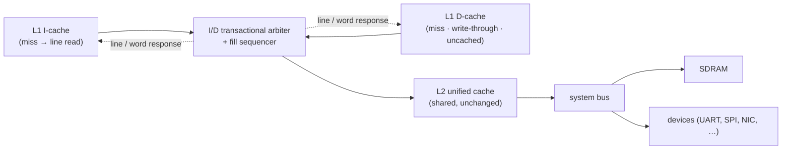

# Penumbra/2 — L1↔L2 Memory Interface and I/D Arbitration

> **Applies to:** Penumbra/2 · pipelined core.

This document specifies the boundary between the split I/D L1 caches
and the shared L2, and the path from L2 to the system bus. It covers
how two L1 miss streams serialise onto the single L2 port, the line
fill path, the transaction taxonomy (including uncacheable and
sub-word accesses, reads and writes), and the obligations the
interface places on the arbiter, the caches, and bus devices.

The *why* — why a new arbiter rather than the gen1 one, why an atomic
full-line fill, why the interface is deliberately neutral about L2's
write policy — lives in
[Decision 14](./design-decisions.md#14-l1l2-memory-interface-and-id-arbitration).
This document is the reference for *what* the interface is.

## Scope and topology

Each L1 cache handles hits internally with registered BRAM storage
(see [BRAM-backed caches](./design-decisions.md#11-bram-backed-caches-with-single-mem-stall)).
On a miss — or on any write, or any uncacheable access — the cache
presents a back-side request. Two L1 masters (instruction and data)
must serialise onto the single CPU-facing port of the shared L2, and
L2 is itself a single master on the system bus.

**gen2-specific:** the I/D arbiter and the fill sequencer.
**Shared, unchanged:** the L2 (`hw/rtl/soc/l2_cache.sv`), the MMU/TLB,
the system bus, and all devices.

This interface sits **past** MMU translation (addresses here are
physical) and **past** the L1 hit path. The core↔MMU↔L1-hit contract
is specified in [the CPU-internal bus document](../cpu-bus.md); the
system bus beyond L2 is governed by
[the Penumbra Bus protocol](../../hardware/bus-protocol.md). This
document is the L1-miss↔L2 layer between them.

## Transaction taxonomy

There are two physical transaction shapes. Only the cacheable read is
multi-beat; everything else is a single beat that behaves exactly as
the gen1 memory port does.

| Transaction | Beats | Fill sequencer | Completion | `byte_en` |
|---|---|---|---|---|
| Cacheable read (miss → fill) | line (N words) | engaged | fill-done | n/a |
| Cacheable write (hit or miss) | 1 | — | downstream busy-drop | **normative** |
| Uncacheable read | 1 | — | downstream busy-drop | advisory ¹ |
| Uncacheable write | 1 | — | downstream busy-drop | **normative** |

¹ Advisory under the default (memory-like) bus contract; a device may
narrow the contract to make read lane-enables normative — see
[MMIO read lane-enables](#mmio-read-lane-enables).

**Sub-word accesses** (byte / halfword) are natural-aligned by the
time they reach here — a misaligned halfword or word faults at MEM
(`penumbra2_mem_stage.sv`, alignment check) and never reaches the
interface. Sub-word is asymmetric between the two directions:

- **Sub-word reads** are *full-word reads*. The memory returns the
  whole word and the core's MEM stage extracts the byte/halfword
  (`byte_ext`, with sign/zero extension). So a sub-word read is just a
  word read to this interface — no distinct shape.
- **Sub-word writes** are *lane-masked word writes*. The store data is
  positioned into the target lane (`byte_rep`) and `byte_en` selects
  the committed lanes, propagating to each cache level's byte-write
  port and to the SDRAM `DQM`. So sub-word adds a distinct shape only
  for writes, carried entirely by `byte_en`.

## The transactional arbiter

The arbiter grants the single L2 port to one owner — instruction or
data side — for the **duration of a whole transaction**, then releases
it on a transaction-type-appropriate completion.

- **Transaction-granular grant.** The owner is held for the entire
  transaction: one beat for a single-beat op, the whole stream for a
  line read. The arbiter never re-arbitrates mid-line and never sees
  "words"; it follows a `txn_done` signal and so carries no line-size
  knowledge.
- **Type-dependent completion.** A line read releases on the fill
  sequencer's done signal; every single-beat op (cacheable write,
  uncacheable read, uncacheable write) releases on the downstream
  busy-drop — the same handshake the gen1 memory port uses.
- **Single-outstanding.** At most one transaction is in flight. This
  is sufficient because the
  [back-pressure stall policy](./design-decisions.md#10-stall-propagation-policy-back-pressure)
  freezes the pipeline during any miss, so the worst-case concurrent
  demand is one in-flight I-miss plus one in-flight D-miss — never a
  queue. Serialising those two is a bounded, infrequent cost.
- **D-priority** on simultaneous pending, as a tiebreaker.
- **Full-shape forwarding.** The arbiter forwards
  `{addr, wdata, byte_en, re, we, cacheable}` for the granted owner —
  not just the address. `byte_en` and `cacheable` are load-bearing
  (see [Interface obligations](#interface-obligations)).

The mental model: **the transactional arbiter is the gen1 single-beat
arbiter plus a line mode.** Cacheable reads use the new line mode;
cacheable writes, uncacheable reads, and uncacheable writes degenerate
to the proven single-beat busy-handshake path. The gen1
`cpu_bus_arbiter` is *not* reused: its per-word `req_accepted`
handshake models the L1 pulling words through a shared bus — the wrong
shape — and its registered-request structure exists to break a
single-cycle critical-path cross-coupling that does not arise once L1
hits are registered and off the critical path.

## The fill path

A cacheable read miss is served by an **atomic full-line fill**: the
whole line is brought in before the stalled access resumes, and a line
carries a single valid bit (no per-word presence tracking).

- **No critical-word-first / early restart.** Returning the requested
  word first and resuming before the rest of the line lands would
  require per-word presence bits, hit-under-fill stalls, fill-vs-store
  hazards, and fill-vs-flush handling. All of these follow from
  puncturing the one invariant the rest of this interface relies on —
  *a miss freezes the core, so every transaction is atomic*. That
  invariant is what lets the arbiter be single-outstanding and
  tag-free. Early restart is therefore a non-blocking-era feature, not
  a gen2 one.
- **No response tags.** Single-outstanding + atomic makes response
  ordering trivial — there is only ever one transaction to route.
- **Dedicated fill sequencer.** On a cacheable read miss the L1
  presents one line request; the sequencer drives the line transfer
  and writes it into the L1 data array, and the arbiter holds the
  owner until the sequencer signals done. The fill streaming lives in
  the sequencer, not the arbiter, keeping the arbiter generic.
- **Mode selection.** `cacheable && re` selects the line mode and
  engages the sequencer; every other request takes the direct
  single-beat path and never touches the sequencer. The L1 guarantees
  the encoding: a forwarded single-beat read (uncacheable, or the
  cache disabled) never presents `cacheable=1` — only a line fill
  does. Writes keep the PTE's cacheable bit, which downstream levels
  use to decide whether to update their own copy.

## Interface obligations

The contract the arbiter, caches, and devices must honour:

1. **Forward `byte_en` in both directions.** On writes it selects the
   committed lanes at every level (L1 byte-write, L2 byte-en update,
   SDRAM `DQM`) — and *every* store is downstream traffic, so this is
   the common case, not an edge case. On reads it identifies the lane
   actually consumed, which a side-effecting device may depend on
   (see [MMIO read lane-enables](#mmio-read-lane-enables)). The
   interface must not drop read lane-enables as "advisory."
2. **Speculation and line-fill engage only when `cacheable`.** A line
   fill, and any downstream `addr+N` prefetch, must be gated by the
   cacheable bit. A speculative read of an adjacent word or lane is a
   phantom access — harmless on side-effect-free memory, a correctness
   bug on a side-effecting device.
3. **Completion is transaction-type-dependent** — line reads on
   fill-done, single-beat ops on the downstream busy-drop.
4. **"Single-beat" is a property of *this* layer, not system-wide.**
   L1↔L2 writes are single-beat; the L2↔memory side may use multi-beat
   transfers (e.g. a write-back eviction). Obligations are scoped to
   the layer they describe.
5. **Write-through cascade.** A store propagates to the next level
   regardless of hit/miss; each level byte-en-updates its own copy
   *if* it holds the line and forwards the write onward. No
   coordinated multi-target write — each level acts independently as
   the write passes (see [Write cascade and coherence](#write-cascade-and-coherence)).

### MMIO read lane-enables

Under the default bus contract a read drives all 32 bits and the
master extracts; read `byte_en` is advisory
([Penumbra Bus — Access Width](../../hardware/bus-protocol.md#access-width)).
That is correct for memory, which has no read side effects. A device
with **per-lane read side effects** (an RX-FIFO that pops on read, a
read-to-clear status register, an interrupt-acknowledge register) may
narrow the contract and *honour* read `byte_en`, firing side effects
only on the consumed lanes. The core already drives the precise
one-hot lane for a sub-word read, so such a device is adaptable — *as
long as the interface preserves read `byte_en` end-to-end* (obligation
1). The standing convention for new devices remains **word-strided
registers** (one register per word, no cross-lane read side effects),
which sidesteps the question; the obligation exists so the capability
is never silently lost for the device that genuinely needs it.

## Write cascade and coherence

L1 and L2 are write-through, write-no-allocate. A store therefore
always reaches memory, and never leaves a cache holding the only copy.

- **The "double update" is a cascade, not a coordinated op.** A store
  resident in both L1 and L2 is updated at each level independently:
  L1 byte-en-updates its copy on a hit and forwards the write; L2
  byte-en-updates its copy on a hit and forwards to memory. `byte_en`
  carries the lane to each level. Under atomic single-outstanding the
  store does not retire until the write reaches memory, so all copies
  are coherent by retire.
- **Store-then-load stays coherent without L1 allocation.** A store
  that misses L1 but hits L2 updates L2's copy (write-no-allocate
  leaves L1 untouched); a later load misses L1, hits L2, and fills L1
  with the current data. The enabler is that L2 *updates on a write
  hit* (keeps the line) rather than invalidating it — a property
  independent of whether L2 is write-through or write-back.
- **Assumptions** (software-managed, unchanged from gen1, stated so
  they are not silent):
  - A physical address is not aliased by both cacheable and
    uncacheable mappings without an explicit cache maintenance step;
    an uncacheable write does not snoop a cached copy.
  - DMA bypasses the caches. Before a device reads a buffer, software
    ensures dirty data is written back; before reading device-written
    data, software invalidates. This is phrased as operations, not as
    "memory is always current" — see
    [Write-policy neutrality](#write-policy-neutrality).

## Write-policy neutrality

The interface is deliberately neutral about L2's write policy. The I/D
arbiter is **L1-facing**; write-back and write-allocate are
**L2-internal and L2↔memory** concerns, on the far side of L2 from the
arbiter:

| What a write-back L2 adds | Where it lives | Touches this interface? |
|---|---|---|
| Dirty bits | L2-internal state | no |
| Dirty-line eviction (line write to memory) | L2↔memory side | no |
| Write-allocate (store-miss → fill + dirty) | L2-internal store handling | no |
| Flush (vs invalidate-only) maintenance | L2 sysreg + software | no |

From the arbiter's view, L1 still sends a single-beat write-through
and L2 still returns a line on a read; what L2 *does* with the write,
and where it sourced the line, is invisible. The arbiter interface is
identical under write-through, write-back, or write-back +
write-allocate. To keep it that way:

- The **software cache-maintenance contract** is written as operations
  and their semantics (flush writes dirty data back; invalidate drops
  cached copies), never as "memory is always up to date." Under
  write-through, flush is a no-op; under write-back it does work — the
  same contract text holds for both.
- The **bus protocol** does not preclude multi-beat writes; a
  write-back eviction can use repeated single writes or a write burst,
  both on the L2↔memory side.

Whether gen2.5 adopts write-back (and, less likely, write-allocate) is
left to measurement on gen2 — see
[Deferred fill-speed directions](#deferred-fill-speed-directions).

## Deferred fill-speed directions

With the fill atomic and the L2 unchanged, the fill *penalty* per miss
is set by the rate at which L2 returns a line. Reducing it has a
ladder of accelerations, ordered by how far each reaches into the
shared L2. **These are design space gated by gen2 bottleneck
measurements, not commitments** — gen2 ships correctness-first with the
L2 untouched.

| Direction | Effect | Reach into shared L2 |
|---|---|---|
| L2 read-pipeline decouple (initiation interval) | a line returns in roughly `N+latency` cycles instead of `2N` | control-only; storage untouched |
| Wide L1↔L2 datapath | a line returns in `N/W` beats | L2 data-array reorganisation |
| Write buffer | a store retires without waiting on the L2→memory write | new buffer at a chosen layer |

- **L2 initiation interval.** The L2 read pipeline admits one request
  only every few cycles because its stage-0 latch fires only while the
  downstream stage is free; the storage path itself reads a fresh
  address each cycle and is not the limiter. The interval tracks the
  L2's `HIT_LATENCY`: the gen2 machine registers the read verdict at an
  extra stage (`HIT_LATENCY=3`, a fetch-cone fmax fix — see
  [the L2 cache design](../l2-cache.md#pipeline-hit_latency3-the-gen2-machine)),
  which lengthens the interval by a cycle and so serialises a line
  fill's back-to-back reads more. That makes this decouple the most
  concrete fill-speed lever for gen2. A characterisation test
  (`test_back_to_back_read_throughput` in `hw/sim/tb_l2_cache.cpp`)
  measures the interval, so any future decouple is verifiable against
  a baseline.
- **Wide datapath and the atomic-fill choice.** Because the fill is
  atomic, the whole line sits on the stalled path, so reducing the
  beat count cuts the stall proportionally — the structurally simple
  dual of the early restart this design rejects. A wide datapath
  cashes out only if L2 can *produce* a line wide, which is a storage
  reorganisation; it is therefore a larger step than the
  initiation-interval decouple.
- **Write buffer.** Because every store is write-through traffic and
  the slow leg is L2→memory, a buffer placed *after* L2 targets that
  leg directly while L2's update-on-hit keeps refills correct. A
  buffer relaxes single-outstanding on the write side and so belongs
  with the non-blocking work, not gen2.

## See also

- [Decision 14 — L1↔L2 memory interface and I/D arbitration](./design-decisions.md#14-l1l2-memory-interface-and-id-arbitration)
  — the rationale and alternatives behind this interface.
- [The CPU-internal bus document](../cpu-bus.md) — the core↔MMU↔L1-hit
  contract upstream of this interface.
- [The L2 cache design](../l2-cache.md) — the shared L2 this interface
  drives.
- [The Penumbra Bus protocol](../../hardware/bus-protocol.md) — the
  system bus past L2, including byte-lane semantics and bursts.
