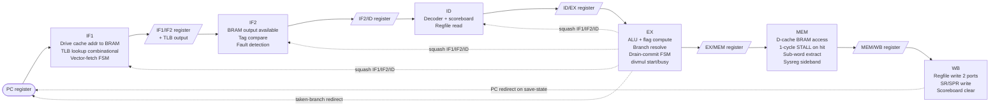

# Penumbra/2 — Pipeline Stages

> **Applies to:** Penumbra/2 · pipelined core.

This document specifies the **6-stage pipeline structure** of Penumbra/2:
which work happens in which stage, what state lives in each
inter-stage pipeline register, and how stalls and squashes propagate
between stages. It is the foundational gen2 internals document —
[control-decode.md](./control-decode.md),
[hazard-model.md](./hazard-model.md),
[exception-flow.md](./exception-flow.md), and
[regfile.md](./regfile.md) all reference its stage boundaries and
register layouts.

The *why* behind the choices recorded here lives in
[design-decisions.md](./design-decisions.md). This document is the
*how*.

## Scope

**In scope:**
- The six pipeline stages (IF1 / IF2 / ID / EX / MEM / WB) and the
  work each one performs.
- The five inter-stage pipeline registers (IF1/IF2, IF2/ID, ID/EX,
  EX/MEM, MEM/WB) and their bit-level contents.
- Stall sources and the rules by which stalls propagate between
  stages.
- Squash sources and the rules by which squash propagates.
- Cycle-accurate timing examples for common pipeline behaviors.

**Out of scope** (with cross-references):
- Per-stage *combinational decoder* contents — see
  [control-decode.md](./control-decode.md).
- The *scoreboard* and physical-register addressing — see
  [hazard-model.md](./hazard-model.md).
- Fault detection, fault propagation, save-state pulse details,
  vector-fetch FSM — see [exception-flow.md](./exception-flow.md).
- Regfile port layout, banking, read-port replication, divmul
  write sequencing — see
  [regfile.md](./regfile.md).
- MMU and cache integration internals — see
  [mmu-internals.md](../mmu-internals.md) and
  [cpu-bus.md](../cpu-bus.md).
- Microarchitectural rationale for the 6-stage shape, hazard
  policy, branch resolution, control architecture, BRAM-backed
  caches — see [design-decisions.md](./design-decisions.md).

## Pipeline architecture

Penumbra/2 is a **6-stage** pipeline: IF1 / IF2 / ID / EX / MEM / WB.
The split IF + single MEM-with-STALL shape comes from the BRAM-backed
cache decision ([Decision 11](./design-decisions.md#11-bram-backed-caches-with-single-mem-stall)):
BRAM with registered output has 1-cycle access latency, which IF
absorbs as an extra stage (every fetch pays it) while MEM absorbs as
a 1-cycle STALL on hit (only loads/stores pay it).



Every cycle, each pipeline register advances its contents to the
next stage *unless* a stall holds it. The pipeline is single-issue
and in-order. There are no out-of-order completions: instructions
enter IF1 in program order and complete WB in program order. (The
divmul unit is the lone multi-cycle exception, and it back-pressures
the entire upstream pipeline via the policy in
[Decision 10](./design-decisions.md#10-stall-propagation-policy-back-pressure).)

**Asymmetric BRAM treatment.** IF1+IF2 splits the 1-cycle BRAM
latency into a pipeline stage because every instruction is fetched
and the cost is paid only once per insn end-to-end. MEM stays a
single stage and STALLs for 1 cycle only when loads/stores actually
access D-cache; ALU/branch/sysreg-internal insns pass through MEM
in 1 cycle with no stall. Full rationale in
[Decision 11](./design-decisions.md#11-bram-backed-caches-with-single-mem-stall).

## Per-stage description

### IF1 — Instruction Fetch (address generation)

**Work performed:**
- Drive `i_vaddr ← PC` to the BRAM-backed I-cache combinationally.
  The cache's BRAM input register samples the address at this
  cycle's clock edge; on the next clock the BRAM output is
  combinational from the registered address.
- Drive `i_vaddr ← PC` to the TLB combinationally (TLB stays
  distributed-RAM async lookup, gen1-inherited). TLB output —
  paddr, fault bits — is available within IF1 cycle.
- On `vector_fetch_pending` (set by exception entry): switch to
  vector-fetch mode (drive cache address to `vec_num × 4`, signal
  MMU bypass, suppress normal PC advance), wait for the loaded
  value at IF2's BRAM output, redirect PC there, return to normal
  fetch.
- On taken-branch squash signal from EX: invalidate the address
  being driven; refetch from the branch target next cycle.
- Latch into the IF1/IF2 register at end of cycle: PC of this
  fetch, next_PC (`PC + 4`), TLB output (paddr_tag and fault bits),
  and a `valid` bit (0 if squashed).

**PC updates:**
- Default: `PC ← PC + 4` each cycle the fetch advances.
- Taken branch: `PC ← EX.branch_target` (signal from EX).
- ERET drain-commit: `PC ← EPC` (signal from EX).
- Save-state pulse: `PC ← vector_load_value` (from IF2's BRAM
  output during vector-fetch mode).

**Owns:** PC register, vector-fetch FSM, `ei_shadow` 1-bit register
(see [exception-flow.md](./exception-flow.md)).

### IF2 — Instruction Fetch (tag compare + delivery)

**Work performed:**
- Receive the BRAM output combinationally during this cycle: tag,
  data, and the valid bit for the addressed line. (The address was
  registered into the BRAM at the IF1→IF2 edge; output appears
  during IF2 by REGMODE_A=NOREG semantics.)
- Receive the registered TLB output from the IF1/IF2 pipeline
  register: paddr_tag, fault bits.
- Compare BRAM tag against TLB-provided paddr_tag → hit signal
  (combinational, ~2 ns).
- Mux BRAM data → `ir` (the instruction word) gated on hit.
- Detect IF-stage faults: TLB miss/protection (from the IF1/IF2
  register), bus fault (held from cache fill — propagated as a
  fault from the cache module), alignment (rare on fetch since
  branches target 4-byte-aligned PCs).
- On cache miss: assert stall, drive the cache to begin a line fill,
  hold the IF1/IF2 register until the fill returns and the next
  tag compare hits.
- Latch into the IF2/ID register at end of cycle: instruction word
  (`ir`), this insn's PC, next_PC, fault bit and vector, valid.

**Owns:** the IF2-side combinational logic — tag compare, hit mux,
fault aggregation.

### IF/ID interface note

The original "IF" pipeline register (IF/ID) is now the **IF2/ID
register** — written by IF2 at end of its cycle, read by ID at the
start of the next. The IF1/IF2 register is new — its purpose is to
carry PC, next_PC, and TLB output from IF1 to IF2 so the cache
access (which happens at the IF1→IF2 edge) can complete and have
its result combined with TLB output in IF2.

### ID — Instruction Decode

**Work performed:**
- Combinationally decode the instruction in the IF/ID register into
  a control bundle (see [control-decode.md](./control-decode.md)).
- Map architectural register references to physical scoreboard
  entries (using current `SR.S` for `R14`); see
  [hazard-model.md](./hazard-model.md).
- Check scoreboard valid bits for source operands; if any source is
  pending, stall. (Flag reads do not appear here — NZCV is forwarded in
  EX, not scoreboard-tracked; see
  [Flag (NZCV) hazard model](./hazard-model.md#flag-nzcv-hazard-model).)
- On no stall: read source operands from the regfile (asynchronous
  read), latch the control bundle + operand values + this
  instruction's PC into the ID/EX register, clear destination's
  scoreboard valid bit.
- Detect illegal-opcode, privilege, and BREAK/SYSCALL exceptions
  here; set fault bit in ID/EX register on detection.

**Owns:** the per-cycle decoder logic; scoreboard read ports;
regfile read ports.

### EX — Execute

**Work performed:**
- Compute ALU result from operand A, operand B (from regfile or
  immediate per the control bundle).
- Compute flag value (NZCV) from ALU.
- Resolve branches: compute branch target (PC + sign-extended offset
  for B-format; operand A for JMP Rs / ERET-via-EPC). Compare the
  condition code against the **forwarded** NZCV — the flag bypass
  selects the youngest in-flight flag writer (MEM/WB→EX) or committed SR
  ([Decision 12](./design-decisions.md#12-nzcv-flag-forwarding),
  [Flag (NZCV) hazard model](./hazard-model.md#flag-nzcv-hazard-model)),
  so a flag reader never stalls on its producer.
- For taken branches: assert squash to IF and ID; assert PC redirect
  to IF.
- For drain-commit instructions (ERET, WRSYS): assert
  `dc_stall_id_if` and hold the instruction in EX until MEM and WB
  hold bubbles, then commit from EX (see
  [exception-flow.md](./exception-flow.md) and
  [Decision 9](./design-decisions.md#9-drain-commit-primitive)).
- For MUL/DIV: pulse `divmul.start` with operands; assert
  `divmul_stall` and hold the instruction in EX until
  `divmul.busy` clears (~33 cycles).
- For ALU/load/store: latch ALU result, operand values needed
  downstream (e.g., store data for STx), control bundle, and
  this-PC into the EX/MEM register.

**Owns:** ALU, branch target adder, the NZCV flag bypass (MEM/WB→EX),
drain-commit FSM, divmul start/busy control.

### MEM — Memory Access (single stage, STALL on D-cache access)

**Work performed:**
- For loads/stores: drive D-side memory request — vaddr from EX/MEM
  register, MMU/TLB lookup combinationally during this cycle, BRAM
  D-cache address input at this cycle's clock edge.
- **Assert 1-cycle STALL on every D-cache access.** This holds the
  pipeline for one cycle while the BRAM output settles. At the next
  clock, BRAM output is combinational; tag compare against TLB
  paddr_tag happens combinationally; hit detected; data extracted
  or written; STALL deasserts; instruction advances to MEM/WB at the
  following edge. (Total MEM occupancy for loads/stores: 2 cycles.)
- On cache miss: hold STALL until the line fill completes (existing
  cache-miss behavior, many cycles).
- Alignment check happens combinationally on entry to MEM (before
  driving cache). On misalignment, set fault bit (alignment) in
  MEM/WB register at end of the 2-cycle MEM occupancy; suppress
  cache request.
- On MMU fault (TLB miss / protection on data side): set fault bit
  in MEM/WB register; suppress cache request and the WB write.
- For loads (hit): extract sub-word value (byte / half / word;
  sign-extend or zero-extend per control bundle) combinationally
  from the cache response. Latched into MEM/WB at end of MEM
  occupancy.
- For stores (hit): replicate sub-word data into the appropriate
  byte lanes before issuing the cache write.
- For RDSYS: drive the sysreg sideband — `o_sys_dev`, `o_sys_reg` —
  during MEM. The device's registered response arrives on the next
  cycle; MEM asserts STALL for that one cycle (same mechanism as
  D-cache hit). Total MEM occupancy: 2 cycles. WRSYS does not enter
  MEM (it commits in EX as drain-commit per
  [Decision 9](./design-decisions.md#9-drain-commit-primitive)).
- **For ALU / branch / ERET / RDSPR / WRSPR / sysreg-internal insns**:
  MEM is a single-cycle pass-through with no STALL. The instruction's
  payload (ALU result, flag value, GPR/SPR write info) advances to
  MEM/WB on the next clock edge.

**Owns:** MMU integration on the D-side; D-cache integration
(BRAM-backed, per [Decision 11](./design-decisions.md#11-bram-backed-caches-with-single-mem-stall));
alignment-check logic; sub-word extract / replicate combinational
logic; the 1-cycle STALL FSM for D-cache and RDSYS access.

### WB — Writeback

**Work performed:**
- If `gpr_we` is set in the MEM/WB register and `fault_pending` is
  not set: write the result to the regfile's main write port at
  `gpr_dst` ← `gpr_value`.
- If `spr_we` is set and no fault: write the SPR file at `spr_dst`
  ← `spr_value`.
- If `flag_we` is set and no fault: write SR's flag bits ← flag
  value from the MEM/WB register.
- If `fault_pending` is set: suppress all writes. Trigger the
  exception save-state pulse (see
  [exception-flow.md](./exception-flow.md)): EPC ← faulting PC,
  ESR ← SR, mode-bits update, R14 bank-swap, IF goes into
  vector-fetch mode for `fault_vec`.
- Clear the scoreboard valid bit for the just-written destination
  (for MUL/DIV, both `Rd` and `Rdh` — the divmul occupies WB for
  two cycles writing low then high through the single port, and both
  bits return together when it leaves WB; see
  [Interaction with divmul](./hazard-model.md#interaction-with-divmul)).

**Owns:** regfile main write port; SR write port; SPR file write
ports; scoreboard set/clear (set on issue, cleared here on commit).

## Inter-stage pipeline registers

Each pipeline register is a flop bank that latches at the rising
clock edge unless held by a stall signal. The contents below are
the **upper bound** of what each register carries — many fields are
"don't care" for some instruction types but are spec'd as part of
the register layout for simplicity.

### IF1/IF2 register

Written by IF1, read by IF2. Carries the in-flight fetch's PC and
the TLB lookup result (since BRAM access spans the IF1→IF2 edge,
the TLB output computed combinationally in IF1 must be registered
here so IF2's tag compare can use it alongside the BRAM output that
becomes available during IF2).

| Field | Bits | Description |
|-------|------|-------------|
| `pc` | 32 | This fetch's PC |
| `next_pc` | 32 | `PC + 4` |
| `tlb_paddr_tag` | ~20 | TLB-translated physical tag bits (for tag compare in IF2) |
| `tlb_fault` | 1 | TLB miss or protection fault detected in IF1 |
| `tlb_fault_kind` | 2 | Encodes TLB miss vs protection vs alignment |
| `vector_fetch_mode` | 1 | 1 = this fetch is a vector-table indirect load (MMU bypassed); affects IF2's downstream handling |
| `valid` | 1 | 0 = bubble (squashed or never-issued) |

Total: ~89 bits.

### IF2/ID register

Written by IF2, read by ID at the start of the next cycle. This is
the "instruction available for decode" boundary.

| Field | Bits | Description |
|-------|------|-------------|
| `ir` | 32 | Instruction word fetched (from BRAM output, gated on cache hit) |
| `pc` | 32 | This instruction's PC |
| `next_pc` | 32 | `PC + 4` (used as EPC for SYSCALL/BREAK and IRQ EPC) |
| `valid` | 1 | 0 = bubble (squashed, cache miss not yet resolved, or never-issued) |
| `fault_pending` | 1 | Set on IF-stage fault (TLB, bus fault on fetch, alignment) |
| `fault_vec` | 4 | Vector number when `fault_pending = 1` |

Total: 102 bits.

### ID/EX register

Written by ID, read by EX. ID performs the **full** operand select, so
`op_a`/`op_b` are the *final* ALU inputs — EX feeds them straight to the
ALU with no further operand mux. The `a_sel`/`b_sel` (PC, immediate)
controls and the immediate value are consumed in ID and do not ride
here.

| Field | Bits | Description |
|-------|------|-------------|
| `ctrl` | ~30 | Decoded control bundle: alu_op, op_class, flag_we, gpr_we, spr_we, mem_op, cond, sysreg/SPR selects, drain_commit, is_trap, etc. — full layout in [control-decode.md](./control-decode.md) |
| `pc` | 32 | This insn's PC (propagated for EPC + branch target) |
| `next_pc` | 32 | `PC + 4` (branch/JALR link, SYSCALL/BREAK/IRQ EPC) |
| `op_a` | 32 | Final ALU operand A: the regfile port-A read, or PC for a branch target. For MUL/DIV: the multiplicand / 32-bit dividend |
| `op_b` | 32 | Final ALU operand B: the regfile port-B read, or the sign/zero-extended immediate. For MUL/DIV: the multiplier / divisor |
| `store_data` | 32 | The value a store writes — the raw regfile port-B (`Rs`) read. Kept separate from `op_b` because a store's `op_b` is the address offset, not the stored value. Don't-care for non-stores |
| `phys_dst` | 5 | Physical scoreboard entry to clear on commit (Rd) |
| `phys_dst_hi` | 5 | Second physical entry for the MUL/DIV high-half result (`Rdh`, write-only); unused otherwise |
| `valid` | 1 | 0 = bubble |
| `fault_pending` | 1 | Propagated from IF/ID, or set in ID (illegal, privilege). SYSCALL/BREAK are *traps*, not faults — they ride `is_trap` in `ctrl` and are taken at EX ([control-decode.md](./control-decode.md)) |
| `fault_vec` | 4 | Vector number (the IF fault, or the decode-detected illegal/privilege/trap vector) |

Total: ~206 bits — the widest pipeline register. Note divmul takes only
two ALU inputs (`op_a`, `op_b`) and writes `Rd`+`Rdh`; `store_data` is
the store path's value, unrelated to divmul.

### EX/MEM register

Written by EX, read by MEM.

| Field | Bits | Description |
|-------|------|-------------|
| `ctrl_mem` | ~12 | Subset of ctrl needed downstream: mem_op (read/write/none), mem_size, sign_ext, sysreg_dev, sysreg_reg, sysreg_op |
| `ctrl_wb` | ~10 | Subset needed at WB: gpr_we, spr_we, flag_we, gpr_dst, spr_dst |
| `pc` | 32 | For EPC if fault |
| `result` | 32 | ALU output (load address for loads, store address for stores, sysreg sideband data for SYS, GPR result for ALU ops) |
| `store_data` | 32 | Value to store (for STx) or written value (for ALU writeback) |
| `flag_value` | 4 | NZCV computed by ALU |
| `phys_dst` | 5 | Physical entry to clear on commit |
| `valid` | 1 | 0 = bubble |
| `fault_pending` | 1 | |
| `fault_vec` | 4 | |

Total: ~133 bits.

### MEM/WB register

Written by MEM, read by WB.

| Field | Bits | Description |
|-------|------|-------------|
| `ctrl_wb` | ~10 | gpr_we, spr_we, flag_we, gpr_dst, spr_dst |
| `pc` | 32 | For EPC if fault |
| `gpr_value` | 32 | Value to write to GPR file (loaded data for LDx, ALU result for ALU ops, sysreg-read data for RDSYS) |
| `spr_value` | 32 | Value to write to SPR (for WRSPR); shares bits with `gpr_value` when only one is active — but kept separate here for clarity |
| `flag_value` | 4 | NZCV to write to SR |
| `phys_dst` | 5 | Physical entry to clear on commit |
| `valid` | 1 | 0 = bubble |
| `fault_pending` | 1 | |
| `fault_vec` | 4 | |

Total: ~121 bits.

## Stall sources

Stalls are asserted by individual conditions and combined per stage.
A stalled stage holds its *input* pipeline register's contents and
its own internal state; its *output* register is also held (the
downstream stage gets the same payload again next cycle, or a bubble
if the downstream stage's stall logic forces it).

| Source | Stage origin | Cause | Reference |
|--------|--------------|-------|-----------|
| I-cache miss | IF2 | BRAM read returned valid=0; line fill needed | [Decision 11](./design-decisions.md#11-bram-backed-caches-with-single-mem-stall) |
| Vector-fetch in progress | IF1 | Save-state pulse just fired; FSM waiting for vector indirect load | [exception-flow.md](./exception-flow.md) |
| Scoreboard pending | ID | Source operand's physical entry valid bit = 0 | [hazard-model.md](./hazard-model.md) |
| Drain-commit drain | EX | ERET or WRSYS waiting for MEM/WB to drain | [Decision 9](./design-decisions.md#9-drain-commit-primitive) |
| Drain-commit post-commit wait | EX (1 cycle for WRSYS) | Waiting for sysreg device to latch | [Decision 9](./design-decisions.md#9-drain-commit-primitive) |
| divmul busy | EX | Multi-cycle MUL/DIV iteration (~33 cycles) | [Decision 1](./design-decisions.md#1-project-goals-and-non-goals) |
| **D-cache BRAM access (hit)** | MEM | 1-cycle STALL on every load/store to absorb BRAM output latency | [Decision 11](./design-decisions.md#11-bram-backed-caches-with-single-mem-stall) |
| D-cache miss | MEM | Line fill in flight (continues from BRAM-access STALL) | [Decision 11](./design-decisions.md#11-bram-backed-caches-with-single-mem-stall) |
| Sysreg sideband wait | MEM | RDSYS waiting one cycle for device's registered response (same STALL mechanism as D-cache hit) | [sysregs.md](../../system/sysregs.md) |
| IRQ drain-and-take | IF1 | IF1 stops fetching once IRQ accepted; pipeline drains | [exception-flow.md](./exception-flow.md) |

## Squash sources

Squash signals force a pipeline register's *output* (going to the
next stage) to a bubble for one or more cycles. Squashes do not
roll back already-committed state — they only suppress in-flight
instructions that haven't yet committed.

| Source | Stage origin | Stages squashed | Reference |
|--------|--------------|-----------------|-----------|
| Taken branch | EX | IF1, IF2, ID (**3-bubble flush**) | [Decision 5](./design-decisions.md#5-branch-resolution-policy) |
| ERET drain-commit | EX | IF1, IF2, ID (also commits SR/PC; MEM/WB drained before commit) | [Decision 9](./design-decisions.md#9-drain-commit-primitive) |
| Fault commit at WB | WB | IF1, IF2, ID, EX, MEM (whatever is still in flight younger than the faulting insn) | [exception-flow.md](./exception-flow.md) |
| Vector-fetch redirect | IF1 | (no squash — the FSM redirects PC, downstream stages are already empty from the drain) | [exception-flow.md](./exception-flow.md) |

## Stall propagation policy

When multiple stages stall simultaneously (e.g., IF takes an I-cache
miss while MEM is mid-D-cache-fill, or ID scoreboard-stalls while
EX drain-commits), the policy determines whether stalls propagate
strictly upstream (back-pressure), freeze the whole pipeline, or
remain independent per-stage.

There are three textbook options with different throughput and
complexity:

1. **Whole-pipeline freeze.** Any stall in any stage holds *every*
   pipeline register. Simplest. Worst throughput: a 50-cycle SDRAM
   fill in MEM also freezes IF, so a future-independent I-cache hit
   that could have overlapped is wasted.

2. **Back-pressure (stall-ahead).** A stall in stage N holds N's
   input register and propagates "I can't accept" upstream, freezing
   stages 0..N-1. Downstream of N drains naturally (bubbles fill
   behind as N stays stuck). Textbook standard. Some overlap
   opportunity preserved.

3. **Independent per-stage stalls with bubble injection.** Each
   stage stalls itself and inserts bubbles downstream when stuck.
   IF stall holds IF only; downstream drains. MEM stall holds MEM
   only; downstream drains and upstream bubbles flow *into* MEM (or
   pile up at the stall point). Most complex; gets the most overlap.

**gen2 policy: option 2 — back-pressure.** A stalled stage holds
its input register and propagates "I can't accept" upstream
(stages 0..N also hold). Downstream of the stall advances normally
(bubbles fill behind).

This is the standard textbook formulation and the simplest *correct*
policy that handles all stall sources uniformly. Whole-pipeline
freeze (the earlier draft pick) was abandoned when it became clear
it deadlocks on scoreboard hazards: a stalled consumer in ID would
hold its producer in EX/MEM/WB too, and the producer would never
commit. Back-pressure resolves this naturally, is still simple
(per-stage stall-enable derivation), and is what real implementations
do. Full rationale and alternatives in
[Decision 10](./design-decisions.md#10-stall-propagation-policy-back-pressure).

---

## Squash propagation rules

Squash signals are asserted *combinationally* in the source stage
and are *registered* alongside the next-cycle pipeline-register
update. Specifically:

- A squash from EX (taken branch, ERET drain-commit commit) asserts
  during cycle T; at the rising edge of cycle T+1 the IF1/IF2,
  IF2/ID, and ID/EX *input* registers (i.e., the IF1, IF2, and ID
  stages' contents) are forced to bubble.
- A squash from WB (fault commit) asserts during cycle T; at the
  rising edge of cycle T+1, IF1/IF2, IF2/ID, ID/EX, and EX/MEM are
  forced to bubble.

Squash always *wins* over normal pipeline advance: if a stage would
have produced a real instruction in its output register but is
being squashed, the output register is set to bubble (`valid = 0`).

## Cycle-accurate timing examples

Notation: each table column is one clock cycle. Each row shows the
contents of one pipeline stage at the start of that cycle (i.e.,
the instruction that just arrived from the preceding pipeline
register). Stall and squash effects are annotated.

### Example 1: scoreboard RAW stall on independent ALU pair

```
ADD R1, R2, R3   ; producer
ADD R4, R1, R5   ; consumer (RAW on R1)
```

| Cycle | IF1 | IF2 | ID | EX | MEM | WB | Notes |
|-------|-----|-----|----|------|------|------|-------|
| 1 | ADD1 | — | — | — | — | — | |
| 2 | ADD2 | ADD1 | — | — | — | — | |
| 3 | — | ADD2 | ADD1 | — | — | — | ADD1 issued; scoreboard[R1] cleared |
| 4 | — | — | ADD2 (stall) | ADD1 | — | — | ADD2 sees R1 pending → stall in ID; IF1/IF2 also held |
| 5 | — | — | ADD2 (stall) | bubble | ADD1 | — | continue stall; ID/EX = bubble; ADD1 passes through MEM (no STALL — ALU op) |
| 6 | — | — | ADD2 (stall) | bubble | bubble | ADD1 | ADD1 in WB; scoreboard[R1] set after this cycle |
| 7 | — | — | ADD2 (issues) | bubble | bubble | bubble | ID re-checks, R1 valid → issue |
| 8 | — | — | — | ADD2 | bubble | bubble | |
| 9 | — | — | — | — | ADD2 | bubble | |
| 10 | — | — | — | — | — | ADD2 | ADD2 commits |

Total ADD2 stall: 3 cycles (same as 5-stage version; the extra IF
stage shifts the whole timeline but doesn't change the scoreboard
stall count). ADD1→ADD2 latency end-to-end: 4 cycles (would be 1
cycle with EX→EX forwarding).

### Example 2: CMP → BEQ (flags forwarded, no stall)

```
CMP R1, R2       ; writes flags (subset of SR)
BEQ label        ; reads flags
```

BEQ does **not** stall: NZCV is forwarded, not scoreboarded
([Decision 12](./design-decisions.md#12-nzcv-flag-forwarding)). BEQ
issues the cycle after CMP; when BEQ reaches EX the CMP is in MEM, and
the MEM→EX flag bypass feeds CMP's flags to BEQ's condition check — the
flag dependency costs 0 cycles. If BEQ resolves taken, the **3-bubble
flush** (squash IF1/IF2/ID) still applies; that is the branch *control*
hazard ([Decision 5](./design-decisions.md#5-branch-resolution-policy)),
independent of the now-eliminated flag data hazard.

### Example 3: taken branch with squash

```
B  label         ; unconditional branch
addX             ; never executed (no delay-slot ISA)
addY             ; never executed
addZ             ; never executed
label: ...
```

| Cycle | IF1 | IF2 | ID | EX | MEM | WB | Notes |
|-------|-----|-----|----|------|------|------|-------|
| 1 | B | — | — | — | — | — | |
| 2 | addX | B | — | — | — | — | |
| 3 | addY | addX | B | — | — | — | |
| 4 | addZ | addY | addX | B | — | — | B in EX; computes target, asserts taken + squash to IF1/IF2/ID |
| 5 | label[0] | bubble | bubble | bubble | B | — | IF1 redirected; IF2, ID, EX bubbled |
| 6 | label[1] | label[0] | bubble | bubble | bubble | B | |
| 7 | label[2] | label[1] | label[0] | bubble | bubble | bubble | |

Taken branch penalty: **3 bubble cycles** (addX, addY, addZ
squashed in IF2, ID, EX positions). Grew from 2 in the
originally-planned 5-stage pipeline due to the IF split (Decision 3).

### Example 4: load with cache-hit STALL, then ALU pass-through

```
LDW R1, [R2]     ; load, hits D-cache
ADD R3, R4, R5   ; independent ALU op behind it
```

| Cycle | IF1 | IF2 | ID | EX | MEM | WB | Notes |
|-------|-----|-----|----|------|------|------|-------|
| 1 | LDW | — | — | — | — | — | |
| 2 | ADD | LDW | — | — | — | — | |
| 3 | — | ADD | LDW | — | — | — | |
| 4 | — | — | ADD | LDW | — | — | |
| 5 | — | — | (stall) | (stall) | LDW (BRAM access, STALL asserted) | — | LDW drives D-cache; whole pipeline holds for 1 cycle |
| 6 | — | — | ADD | LDW (advance) | bubble (was LDW stall) | LDW (data ready, advances to WB) | Wait — let me re-think. |

Actually let me redo this more carefully. When MEM asserts STALL on
cycle 5, the pipeline-register update at edge 5→6 is suppressed.
So at cycle 6, the same insns are in the same stages (LDW in MEM,
ADD in EX, etc.). MEM completes its work during cycle 5 (BRAM
output ready at end of cycle 5 from the perspective of the registered
address). STALL deasserts at end of cycle 5. At edge 5→6, the
pipeline advances normally.

Let me redo:

| Cycle | IF1 | IF2 | ID | EX | MEM | WB | Notes |
|-------|-----|-----|----|------|------|------|-------|
| 1 | LDW | — | — | — | — | — | |
| 2 | ADD | LDW | — | — | — | — | |
| 3 | — | ADD | LDW | — | — | — | |
| 4 | — | — | ADD | LDW | — | — | |
| 5 | — | — | ADD (held) | LDW (held) | LDW enters MEM, drives D-cache BRAM, asserts STALL | — | Whole-pipeline holds for 1 cycle |
| 6 | — | — | ADD | LDW (advance) | MEM completes, LDW advances | — | BRAM output, tag compare, hit → STALL deasserts |
| 7 | — | — | — | ADD | bubble | LDW | LDW in WB; ADD passes through MEM next cycle |
| 8 | — | — | — | — | ADD | bubble | ADD in MEM (no STALL — ALU op pass-through) |
| 9 | — | — | — | — | — | ADD | |

So LDW takes 7 cycles end-to-end (vs 6 for ALU); ADD pays 1 cycle
of MEM-STALL behind LDW but otherwise normal. Single-cycle MEM
pass-through for ALU is the key cost saving vs split-MEM.

### Example 5: MUL with multi-cycle EX

```
MUL R1, R2       ; Rd = R1 × R2 (low); Rdh = high (Rdh from IR[15:12])
ADD R5, R1, R6   ; consumer (RAW on R1)
```

| Cycle | IF1 | IF2 | ID | EX | MEM | WB | Notes |
|-------|-----|-----|----|------|------|------|-------|
| 1 | MUL | — | — | — | — | — | |
| 2 | ADD | MUL | — | — | — | — | |
| 3 | — | ADD | MUL | — | — | — | MUL issued; scoreboard[R1, Rdh] cleared |
| 4 | — | — | ADD (stall) | MUL (start) | — | — | divmul.start pulsed |
| 5–37 | — | — | ADD (stall) | MUL (busy) | bubble | bubble | EX held by divmul (~33 cycles) |
| 38 | — | — | ADD (stall) | MUL (done) | bubble | bubble | divmul done; result_lo + result_hi valid |
| 39 | — | — | ADD (stall) | bubble | MUL | bubble | MUL advances to MEM (pass-through, no STALL — divmul output is not a memory access) |
| 40 | — | — | ADD (stall) | bubble | bubble | MUL | WB cycle 1: MUL writes Rd (low) via the single write port. Still in WB → `valid[R1]`/`valid[Rdh]` stay 0 |
| 41 | — | — | ADD (stall) | bubble | bubble | MUL | WB cycle 2: MUL writes Rdh (high) via the same port; pipeline held this extra cycle |
| 42 | — | — | ADD (issues) | bubble | bubble | — | MUL has left WB → `valid[R1]` and `valid[Rdh]` both set; ADD issues |

Total stall on ADD: ~37 cycles (one more than a single-cycle
divmul writeback would cost). Cost dominates any sequence that
issues a MUL or DIV — typical only on math-heavy code paths. Both
valid bits return together when the divmul leaves WB: the held
extra cycle freezes the consumer too, so a low-half-only consumer
gains nothing from the writes being ordered low-then-high (the
ordering is for the single write port, not for early wakeup).

### Example 6: ERET (drain-commit)

```
WRSPR EPC, R1    ; install return PC for fault retry
ERET             ; return
```

| Cycle | IF1 | IF2 | ID | EX | MEM | WB | Notes |
|-------|-----|-----|----|------|------|------|-------|
| 1 | WRSPR | — | — | — | — | — | |
| 2 | ERET | WRSPR | — | — | — | — | |
| 3 | next | ERET | WRSPR | — | — | — | WRSPR issued; scoreboard[EPC] cleared |
| 4 | next2 | next | ERET | WRSPR | — | — | ERET issued (decoded as drain-commit) |
| 5 | (stall) | (stall) | (stall) | ERET (drain) | WRSPR (pass-through) | — | ERET in EX, asserts drain-commit; upstream stalled |
| 6 | (stall) | (stall) | (stall) | ERET (drain) | bubble | WRSPR | WRSPR commits EPC; scoreboard[EPC] set |
| 7 | (squash) | (squash) | (squash) | ERET commits | bubble | bubble | MEM/WB drained; ERET commits: SR ← ESR, PC ← EPC, squash IF1/IF2/ID |
| 8 | EPC[0] | bubble | bubble | bubble | bubble | bubble | New fetch at EPC |

Total ERET cost: ~3 cycles in EX (drain + commit), 3 squashed
upstream. Per syscall-return / IRQ-return; not hot path.

## Cross-references

- [design-decisions.md](./design-decisions.md) — the *why* behind
  every choice this document encodes.
- [control-decode.md](./control-decode.md) — what each opcode
  produces in the decoded control bundle (the `ctrl` field of
  ID/EX).
- [hazard-model.md](./hazard-model.md) — scoreboard semantics, RAW
  detection, ISA→physical mapping.
- [exception-flow.md](./exception-flow.md) — fault detection,
  propagation, save-state pulse, vector-fetch FSM, IRQ
  drain-and-take, ERET commit.
- [regfile.md](./regfile.md) — 2R/1W regfile, R14 banking, scoreboard
  storage organization, distributed-RAM replication.
- [cpu-bus.md](../cpu-bus.md) — CPU ↔ MMU ↔ cache interface
  contracts (shared with Penumbra/1).
- [mmu-internals.md](../mmu-internals.md) — TLB storage and lookup.
- [../system/sysregs.md](../../system/sysregs.md) — sysreg device
  map (used by RDSYS/WRSYS in MEM).
