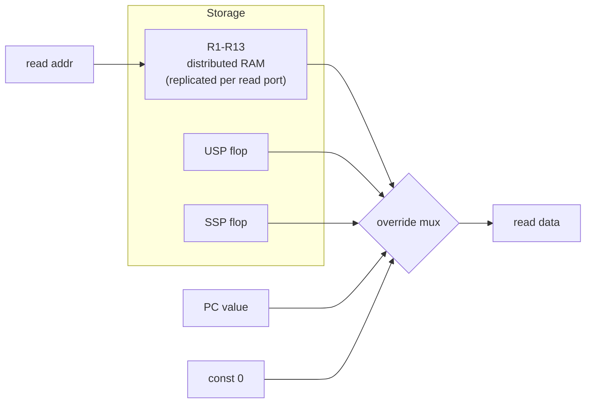

# Penumbra/2 — Register File

This document specifies the Penumbra/2 general-purpose register file:
its storage organisation, the two read ports, the single write port
and how divmul's two-destination result is sequenced through it, the
banked `R14` (USP/SSP) and cross-bank access, and the no-write-through
read semantics. It is the reference for implementing `regfile.sv` (or
`regfile2.sv`) in `hw/rtl/penumbra2/`.

The ISA-visible register model (16 registers, R0 = zero, R15 = PC,
R14 banked, SPR overlap of USP) is fixed by the ISA and shared with
gen1; the authoritative source is
[`doc/system/architecture.md`](../../system/architecture.md) (register
model and banking). This doc specifies the **gen2 microarchitecture**
that realises that model; it does not re-decide ISA behavior.

## Scope

Covered:

- The 16-register model and which registers are live storage vs
  special-cased overrides.
- Storage organisation (distributed RAM + override mux + banked
  flops) and the ECP5 mapping.
- The two read ports (combinational) and one write port.
- How divmul's two-destination result is sequenced through the
  single write port.
- `R14` banking (USP/SSP) and cross-bank `RDSPR/WRSPR USP`.
- No-write-through read semantics and the gen2.5 upgrade path.

Out of scope:

- The ISA→physical scoreboard *mapping* (R14→USP/SSP by `SR.S`,
  SPR-USP cross-bank) — specified in
  [hazard-model.md §5](./hazard-model.md#5-isa--physical-register-mapping);
  this doc gives the storage that mapping addresses.
- SPRs other than USP/SSP (ESR, EPC, SR, SCR0–3) — they live in
  separate modules, not the register file (Section 6).
- The divmul unit's internal algorithm — see
  [divmul.md](../../internals/divmul.md).

## 1. Register model

Sixteen architectural registers, 32 bits each:

| Reg | Role | Live storage? |
|-----|------|---------------|
| R0 | Hardwired zero (reads 0, writes dropped) | No — read override |
| R1–R13 | General purpose | Yes — distributed RAM |
| R14 | Stack pointer, **banked** USP (user) / SSP (supervisor) | Yes — two flops |
| R15 | PC alias (reads the PC; "writes" are branches) | No — read override |

R0 and R15 are not read from the register array: R0 reads force
`0`, and R15 reads return the current PC value. R14 reads/writes are
steered to one of two dedicated flop registers (USP or SSP) rather
than the array. Only R1–R13 are ordinary array storage.

## 2. Storage organisation

The file is a hybrid of three storage styles, matching gen1's
`regfile.sv`:

- **R1–R13** live in **distributed RAM**, replicated once per read
  port (Section 9). The array is physically 16 deep, but slots 0,
  14, 15 are dead — written along with everything else (to keep the
  write path address-decode-free) but never read, because the
  override/bank logic always wins for those addresses.
- **R0 and R15** are an **output override**: after the array read,
  a small mux replaces the array data with `0` (R0) or the PC
  (R15). No storage.
- **USP and SSP** are **two dedicated 32-bit flop registers**, not
  array entries. R14 reads/writes are muxed to one of them by the
  bank select (Section 5).



## 3. Read ports

Two **combinational** read ports (A and B), read by ID in the same
cycle it decodes (asynchronous read — no registered output, so the
operand is available within the ID cycle). Each port:

1. Reads its replicated array copy at the requested address.
2. Applies the override mux: address R0 → `0`; address R15 → PC;
   address R14 → USP or SSP per the bank select; else array data.

There is no third operand read for divmul — it takes only the two
ports (Rd → port A, Rs → port B); see Section 4. The read ports are
on the ID critical path, which is why the array stays distributed
RAM (combinational read) rather than block RAM (registered output);
see [Decision 11](./design-decisions.md#11-bram-backed-caches-with-single-mem-stall)
for the same async-read reasoning applied to the TLB.

## 4. Write port and divmul sequencing

The register file has **one write port**, driven at WB. A normal
instruction performs at most one GPR write per commit, so one port
suffices for every instruction *except* divmul.

### 4.1 divmul is the only two-destination GPR writer

MUL/MULU/DIV/DIVU produce two register results — `Rd` (low half /
quotient) and `Rdh` (high half / remainder). `Rdh` is **write-only**
and selected from `IR[15:12]`; there is no third *input* operand
(divides are always 32/32; see
[control-decode.md §5](./control-decode.md#5-register-operand-selection)).

It would seem to call for a second write port. It does not, because
a true second write port on ECP5 distributed RAM (1W/1R) is not free
— replicating the array buys read ports, not write ports, and a
genuine 2W needs an LVT/XOR multi-write scheme or a flop-based file.
Since divmul is the *only* two-write user and already stalls the
pipeline for its ~33-cycle iteration, gen2 instead **sequences the
two writes through the single port over two consecutive cycles**:

1. Cycle K: write `Rd` ← low half / quotient.
2. Cycle K+1: write `Rdh` ← high half / remainder.

The divmul **holds the pipeline one extra cycle** (back-pressure,
exactly as during its iteration) to perform the second write. **No
extra writeback stage is added** — that would be all cost for one
rare extra write; the existing stall mechanism absorbs it for free.
The one-cycle cost is negligible against the ~33-cycle iteration.

This is the same low-then-high order gen1's microcode uses
(`DML_LO` then `DML_HI`). The divmul instruction occupies WB for
both cycles, so under the re-derive scoreboard
([hazard-model.md §3](./hazard-model.md#3-valid-bit-lifecycle))
`valid[Rd]` and `valid[Rdh]` both clear at issue and both return
together when it leaves WB. The low-then-high order exists only to
share the single port — it gives no early wakeup, since the held
extra cycle freezes any consumer anyway.

### 4.2 The Rd == Rdh case

Nothing in the encoding forbids `Rd == Rdh` (e.g. `MUL R1, R2, R1`).
With sequenced writeback the result is **deterministic**: the high
half is written second (cycle K+1) and wins, so `R1` ends up holding
the high half and the low half is lost. This is well-defined but
useless; software should not encode `Rd == Rdh`. gen2 does not trap
it — defining the outcome (rather than making it `UNPREDICTABLE`) is
free here because sequencing already imposes an order.

### 4.3 ERET and save-state do not use this path

ERET writes `SR` and `PC`, and the exception save-state pulse writes
`EPC`/`ESR`/`SR` plus the R14 bank select — but **none of these are
GPR-file writes**. `SR` lives in `status_reg`, `PC` in the PC
register, `EPC`/`ESR` in their own flops. They are separate storage
elements with their own write paths, so their "multiple writes" never
contend for the register file's single port. **divmul is the only
instruction that writes two GPR-file destinations**; the implementer
should not add a second GPR write port for ERET or save-state.

## 5. R14 banking (USP / SSP)

R14 is physically two flop registers:

- **USP** — user stack pointer, the R14 visible when `SR.S = 0`.
- **SSP** — supervisor stack pointer, the R14 visible when `SR.S = 1`.

Selection is a single XOR:

```
sp_select = SR.S ^ cross_bank      // 0 → USP, 1 → SSP
```

- **Normal R14 access** drives `cross_bank = 0`, so `sp_select =
  SR.S`: user mode reaches USP, supervisor mode reaches SSP.
- **Cross-bank access** — `RDSPR/WRSPR USP` from supervisor mode —
  drives `cross_bank = 1`, flipping the select so supervisor code
  reaches the **user** stack pointer (USP) while `SR.S = 1`. This is
  the only way the kernel reaches the user SP, and it is why the
  scoreboard is physically addressed
  ([hazard-model.md §5.1](./hazard-model.md#51-the-cross-bank-spr-usp-case)):
  supervisor `WRSPR USP` and a later user-mode `R14` read touch the
  same physical flop under different ISA names.

The decoder produces `cross_bank` (it is the `cross_bank` control
bit of [control-decode.md §4](./control-decode.md#4-the-id-control-bundle)),
asserted for `RDSPR/WRSPR USP`. SSP has no cross-bank path: there is
no instruction that reaches the supervisor SP from user mode.

`SR.S` is stable for the lifetime of any instruction in the pipeline
(it changes only at drained/squashed points — ERET, exception entry),
so the bank select is unambiguous; see
[hazard-model.md §7.3](./hazard-model.md#73-srs-quiescence-for-the-decoders-r14-mapping).

## 6. USP/SSP and the SPR space

The register file owns exactly two of the architectural SPRs'
storage, and only because they alias R14:

| SPR | Number | Lives in |
|-----|:------:|----------|
| ESR | 0 | `status_reg` |
| EPC | 1 | PC/exception unit |
| **USP** | 2 | **register file** (the user R14 bank) |
| SR | 3 | `status_reg` |
| SCR0–3 | 4–7 | `spr_scratch` |

USP is ISA SPR #2 *and* user-mode R14 — one physical flop with two
ISA names, which is the whole reason cross-bank access exists. SSP
is supervisor R14 only; it is **not** SPR-addressable. Every other
SPR lives outside the register file, so `RDSPR/WRSPR` to ESR, EPC,
SR, or SCR*n* does not touch the register file at all — only USP
does.

## 7. No write-through (gen2)

gen2's register file has **no write-through / read-during-write
forwarding**: a read in the same cycle a register is being written
returns the **old** value (synchronous write, asynchronous read —
the new value is visible next cycle). This matches gen1 and is the
deliberate no-forwarding baseline of
[Decision 4](./design-decisions.md#4-hazard-handling-strategy).

The consequence is the extra ID stall already specified in
[hazard-model.md §3](./hazard-model.md#3-valid-bit-lifecycle): a
dependent reader cannot issue on the producer's WB cycle (the valid
bit is set at end of cycle), so it stalls one more cycle. gen2.5
closes this with a single mux on the read path (WB→ID write-through)
— a small, localised edit that this organisation deliberately leaves
room for and that does not change the storage.

## 8. ECP5 mapping and cost

- **R1–R13:** replicated **1W/1R distributed RAM**, one copy per
  read port (two copies for ports A and B; gen1 carries a third for
  a debug read). All copies are written in lockstep at the same
  address/data so they stay coherent — replication provides the two
  **read** ports. This is the canonical ECP5 SLICEMEM (`DPR16X*`)
  shape.
- **USP, SSP:** two 32-bit flop registers (~64 FFs) with the XOR
  bank select.
- **R0, R15:** no storage — output-mux overrides (`0`, PC).
- **Write port:** one, address-decode-free (writes hit every array
  copy plus, for address R14, the selected SP flop). The single port
  is what makes the divmul sequencing (Section 4) necessary.

Distributed RAM is chosen over block RAM because the read ports are
combinational on the ID critical path (block RAM's registered output
would add a stage). It is chosen over a pure flop file (which would
make a true 2W trivial) because the flop file's two 16:1×32 read
muxes cost more LUTs than the replicated RAM plus the negligible
divmul sequencing cost — the area/throughput trade lands on RAM +
sequencing.

## 9. Reset and initial state

On `i_rst`, USP and SSP reset to a defined value (`0`); the R1–R13
array contents are undefined until written (kernel boot establishes
them). The scoreboard derives validity from in-flight writers
([hazard-model.md §3](./hazard-model.md#3-valid-bit-lifecycle)), so
no per-register "initialised" tracking is needed in the file itself.

## 10. Cross-references

- [architecture.md](../../system/architecture.md) — the ISA register
  model and R14/USP/SSP banking contract.
- [hazard-model.md §3](./hazard-model.md#3-valid-bit-lifecycle)
  (staggered divmul writes), [§5](./hazard-model.md#5-isa--physical-register-mapping)
  (ISA→physical mapping the banking serves), [§7.3](./hazard-model.md#73-srs-quiescence-for-the-decoders-r14-mapping)
  (SR.S quiescence for the bank select).
- [control-decode.md §4–5](./control-decode.md#4-the-id-control-bundle)
  — the `cross_bank`, `phys_dst`, `phys_dst_hi` control bits that
  drive this file.
- [design-decisions.md §4](./design-decisions.md#4-hazard-handling-strategy)
  — the no-forwarding baseline and the register-file port decision.
- [divmul.md](../../internals/divmul.md) — the two-result divmul unit
  whose writeback this file sequences.
- [pipeline-stages.md §WB](./pipeline-stages.md#wb--writeback) — the
  writeback stage that drives the write port.
