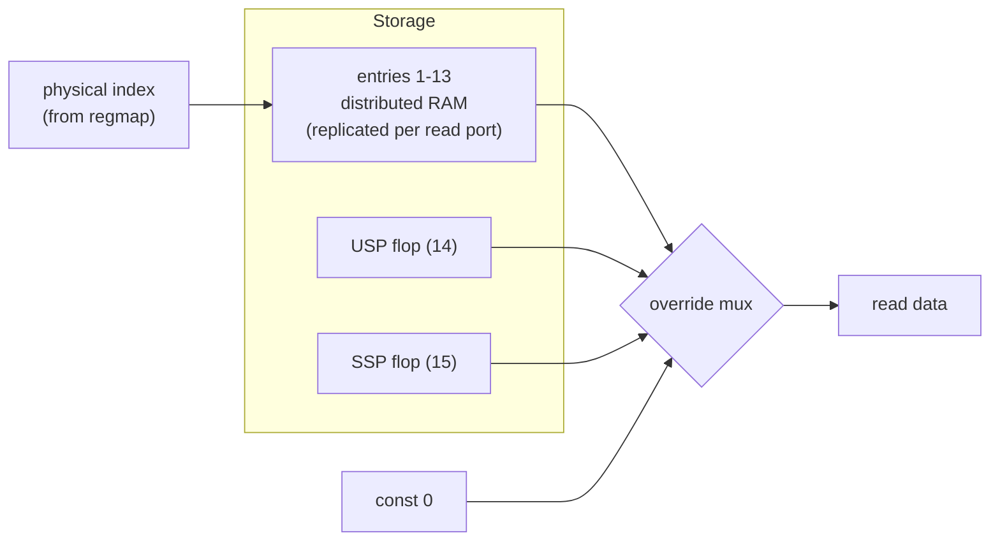

# Penumbra/2 — Register File

> **Applies to:** Penumbra/2 · pipelined core.

This document specifies the Penumbra/2 general-purpose register file:
its storage organisation, the two read ports, the single write port
and how divmul's two-destination result is sequenced through it, the
USP/SSP flop pair, and the no-write-through read semantics. It is the
reference for implementing `penumbra2_regfile.sv` in `hw/rtl/penumbra2/`.

The register file is **physically indexed**. The ISA→physical mapping
— R14→USP/SSP by `SR.S`, the SPR-USP cross-bank case, R0/R15 handling
— is done once in ID by `penumbra2_regmap`
([ISA→physical mapping](./hazard-model.md#isa--physical-register-mapping)),
and the file is addressed by the resulting physical entry index on
both its read ports (in ID) and its write port (the `phys_dst` carried
to WB). The file therefore does **no** banking conditional of its own:
it neither sees `SR.S` nor recomputes the bank select. Mapping in one
place keeps the scoreboard and the register file from ever disagreeing
about which physical entry an access touches.

The ISA-visible register model (16 registers, R0 = zero, R15 = PC,
R14 banked, SPR overlap of USP) is fixed by the ISA and shared with
gen1; the authoritative source is
[`doc/system/architecture.md`](../../system/architecture.md) (register
model and banking). This doc specifies the **gen2 microarchitecture**
that realises that model; it does not re-decide ISA behavior.

## Scope

Covered:

- The physical entry layout the file stores and which entries are
  live storage vs special-cased overrides.
- Storage organisation (distributed RAM + override mux + banked
  flops) and the ECP5 mapping.
- The two read ports (combinational) and one write port, both
  addressed by physical entry index.
- How divmul's two-destination result is sequenced through the
  single write port.
- No-write-through read semantics and the gen2.5 upgrade path.

Out of scope:

- The ISA→physical mapping itself (R14→USP/SSP by `SR.S`, SPR-USP
  cross-bank, R0/R15) — done in ID by `penumbra2_regmap` and
  specified in
  [ISA→physical mapping](./hazard-model.md#isa--physical-register-mapping).
  This file consumes the physical index that mapping produces.
- SPRs other than USP/SSP (ESR, EPC, SR, SCR0–3) — they live in
  separate modules, not the register file ([USP/SSP and the SPR space](#uspssp-and-the-spr-space)).
- The divmul unit's internal algorithm — see
  [divmul.md](../../internals/divmul.md).

## Physical entry layout

The file stores 16 physical entries, indexed 0–15 — the GPR/SP slice
of the scoreboard's physical namespace
([scoreboard storage](./hazard-model.md#scoreboard-storage)). The
SPR entries 16–22 (ESR, EPC, SR, SCR0–3) live in other modules, so a
regfile index is always 0–15:

| Entry | Role | Live storage? |
|-------|------|---------------|
| 0 | R0 — hardwired zero (reads 0, writes dropped) | No — read override |
| 1–13 | R1–R13, general purpose | Yes — distributed RAM |
| 14 | USP — `R14` in user mode / `RDSPR/WRSPR USP` in either mode | Yes — flop |
| 15 | SSP — `R14` in supervisor mode | Yes — flop |

Entry 0 is not read from the array — reads force `0`. Entries 14/15
are the two dedicated flops, selected by the index, not by a bank
conditional in the file: `regmap` has already resolved `R14`+`SR.S`
(and the cross-bank `RDSPR/WRSPR USP` case) to either 14 or 15. Only
entries 1–13 are ordinary array storage.

**R15 (PC) is not an entry here.** ISA reads of R15 are resolved by
the ID operand mux selecting the PC value, never by a regfile read
([register operand selection](./control-decode.md#register-operand-selection)),
and ISA "writes" to R15 are branches. So R15 never reaches a regfile
port and the file carries no PC override and no `i_pc` input. (This
is the one place the register model differs from gen1, whose regfile
did carry an R15→PC override.)

## Storage organisation

The file is a hybrid of three storage styles:

- **Entries 1–13** live in **distributed RAM**, replicated once per
  read port ([Reset and initial state](#reset-and-initial-state)). The array is physically 16 deep, but slots
  0, 14, 15 are dead — written along with everything else (to keep
  the write path address-decode-free) but never read, because the
  override logic always wins for those indices.
- **Entry 0** is an **output override**: after the array read, a
  small mux forces `0`. No storage.
- **USP (14) and SSP (15)** are **two dedicated 32-bit flop
  registers**, not array entries. The override mux selects one of
  them when the index is 14 or 15. Which one a given `R14` access
  reaches is already decided upstream — the index *is* 14 or 15.

The override mux keys purely on the physical index (`== 0`, `== 14`,
`== 15`, else array). There is no `SR.S` or bank-select input: the
banking choice was made upstream in ID, by `regmap`.



## Read ports

Two **combinational** read ports (A and B), read by ID in the same
cycle it decodes (asynchronous read — no registered output, so the
operand is available within the ID cycle). Each port takes a physical
entry index (`phys_src_a`/`phys_src_b` from `regmap`) and:

1. Reads its replicated array copy at that index.
2. Applies the override mux: index 0 → `0`; index 14 → USP; index
   15 → SSP; else array data.

Because the index already encodes the bank (`regmap` resolved
`R14`+`SR.S` to 14 or 15), the read path is mux-on-index only — it
does not see `SR.S`. A read whose operand is actually the PC or an
SPR never reaches these ports: the ID operand mux selects PC for R15
and the SPR modules supply SPR sources, so the regfile output is used
only when the operand is a GPR/SP.

There is no third operand read for divmul — it takes only the two
ports (Rd → port A, Rs → port B); see [Write port and divmul sequencing](#write-port-and-divmul-sequencing). The read ports are
on the ID critical path, which is why the array stays distributed
RAM (combinational read) rather than block RAM (registered output);
see [Decision 11](./design-decisions.md#11-bram-backed-caches-with-single-mem-stall)
for the same async-read reasoning applied to the TLB.

## Write port and divmul sequencing

The register file has **one write port**, driven at WB. A normal
instruction performs at most one GPR write per commit, so one port
suffices for every instruction *except* divmul.

### divmul is the only two-destination GPR writer

MUL/MULU/DIV/DIVU produce two register results — `Rd` (low half /
quotient) and `Rdh` (high half / remainder). `Rdh` is **write-only**
and selected from `IR[15:12]`; there is no third *input* operand
(divides are always 32/32; see
[register operand selection](./control-decode.md#register-operand-selection)).

It would seem to call for a second write port. It does not, because
a true second write port on ECP5 distributed RAM (1W/1R) is not free
— replicating the array buys read ports, not write ports, and a
genuine 2W needs an LVT/XOR multi-write scheme or a flop-based file.
Since divmul is the *only* two-write user and already stalls the
pipeline for its ~33-cycle iteration, gen2 instead **sequences the
two writes through the single port over two consecutive cycles**:

1. Cycle K: write `Rd` ← low half / quotient.
2. Cycle K+1: write `Rdh` ← high half / remainder.

The divmul **holds the pipeline one extra cycle** (back-pressure,
exactly as during its iteration) to perform the second write. **No
extra writeback stage is added** — that would be all cost for one
rare extra write; the existing stall mechanism absorbs it for free.
The one-cycle cost is negligible against the ~33-cycle iteration.

This is the same low-then-high order gen1's microcode uses
(`DML_LO` then `DML_HI`). The divmul instruction occupies WB for
both cycles, so under the re-derive scoreboard
([valid-bit lifecycle](./hazard-model.md#valid-bit-lifecycle))
`valid[Rd]` and `valid[Rdh]` both clear at issue and both return
together when it leaves WB. The low-then-high order exists only to
share the single port — it gives no early wakeup, since the held
extra cycle freezes any consumer anyway.

### The Rd == Rdh case

Nothing in the encoding forbids `Rd == Rdh` (e.g. `MUL R1, R2, R1`).
With sequenced writeback the result is **deterministic**: the high
half is written second (cycle K+1) and wins, so `R1` ends up holding
the high half and the low half is lost. This is well-defined but
useless; software should not encode `Rd == Rdh`. gen2 does not trap
it — defining the outcome (rather than making it `UNPREDICTABLE`) is
free here because sequencing already imposes an order.

### ERET and save-state do not use this path

ERET writes `SR` and `PC`, and the exception save-state pulse writes
`EPC`/`ESR`/`SR` plus the R14 bank select — but **none of these are
GPR-file writes**. `SR` lives in `status_reg`, `PC` in the PC
register, `EPC`/`ESR` in their own flops. They are separate storage
elements with their own write paths, so their "multiple writes" never
contend for the register file's single port. **divmul is the only
instruction that writes two GPR-file destinations**; the implementer
should not add a second GPR write port for ERET or save-state.

## USP / SSP storage (the banking lives in regmap)

The file holds two stack-pointer flops — **USP** (entry 14) and
**SSP** (entry 15) — but it does **not** decide which one an `R14`
access reaches. That decision is `regmap`'s, made once in ID:

```
phys(R14) = SR.S ? SSP(15) : USP(14)        // normal R14 access
phys(USP) = USP(14)                          // RDSPR/WRSPR USP, either mode
```

The XOR that used to read `SR.S ^ cross_bank` lives in `regmap`
([ISA→physical mapping](./hazard-model.md#isa--physical-register-mapping)),
which folds both the mode bank and the cross-bank `RDSPR/WRSPR USP`
case into the physical index it emits. By the time an index reaches
this file it is simply 14 or 15, and the override mux selects the
matching flop — no `SR.S`, no `cross_bank` here.

This is why the scoreboard is physically addressed
([cross-bank SPR-USP case](./hazard-model.md#the-cross-bank-spr-usp-case)):
a supervisor `WRSPR USP` and a later user-mode `R14` read both map to
index 14, so they touch the **same** flop under different ISA names —
and because the *same* `regmap` output drives both this file and the
scoreboard, the hazard check and the storage can never disagree about
which flop that is. `SR.S` is stable for the lifetime of an in-flight
instruction (it changes only at drained/flushed points — ERET,
exception entry), so the index `regmap` computes in ID is still
correct when the write lands at WB; see
[SR.S quiescence](./hazard-model.md#srs-quiescence-for-the-decoders-r14-mapping).

## USP/SSP and the SPR space

The register file owns exactly two of the architectural SPRs'
storage, and only because they alias R14:

| SPR | Number | Lives in |
|-----|:------:|----------|
| ESR | 0 | `status_reg` |
| EPC | 1 | PC/exception unit |
| **USP** | 2 | **register file** (the user R14 bank) |
| SR | 3 | `status_reg` |
| SCR0–3 | 4–7 | `spr_scratch` |

USP is ISA SPR #2 *and* user-mode R14 — one physical flop with two
ISA names, which is the whole reason cross-bank access exists. SSP
is supervisor R14 only; it is **not** SPR-addressable. Every other
SPR lives outside the register file, so `RDSPR/WRSPR` to ESR, EPC,
SR, or SCR*n* does not touch the register file at all — only USP
does.

## No write-through (gen2)

gen2's register file has **no write-through / read-during-write
forwarding**: a read in the same cycle a register is being written
returns the **old** value (synchronous write, asynchronous read —
the new value is visible next cycle). This matches gen1 and is the
deliberate no-forwarding baseline of
[Decision 4](./design-decisions.md#4-hazard-handling-strategy).

The consequence is the extra ID stall already specified in
[valid-bit lifecycle](./hazard-model.md#valid-bit-lifecycle): a
dependent reader cannot issue on the producer's WB cycle (the valid
bit is set at end of cycle), so it stalls one more cycle. gen2.5
closes this with a single mux on the read path (WB→ID write-through)
— a small, localised edit that this organisation deliberately leaves
room for and that does not change the storage.

## ECP5 mapping and cost

- **Entries 1–13:** replicated **1W/1R distributed RAM**, one copy
  per read port (two copies, for ports A and B). All copies are
  written in lockstep at the same index/data so they stay coherent —
  replication provides the two **read** ports. This is the canonical
  ECP5 SLICEMEM (`DPR16X*`) shape.
- **USP (14), SSP (15):** two 32-bit flop registers (~64 FFs),
  selected by an index compare (`== 14` / `== 15`) — no bank-select
  XOR in this module; `regmap` did that.
- **Entry 0 (R0):** no storage — output-mux override to `0`.
- **Write port:** one, address-decode-free (writes hit every array
  copy plus, when the index is 14/15, the selected SP flop). The
  single port is what makes the divmul sequencing ([Write port and divmul sequencing](#write-port-and-divmul-sequencing))
  necessary.

Distributed RAM is chosen over block RAM because the read ports are
combinational on the ID critical path (block RAM's registered output
would add a stage). It is chosen over a pure flop file (which would
make a true 2W trivial) because the flop file's two 16:1×32 read
muxes cost more LUTs than the replicated RAM plus the negligible
divmul sequencing cost — the area/throughput trade lands on RAM +
sequencing.

## Reset and initial state

On `i_rst`, USP and SSP reset to a defined value (`0`); the R1–R13
array contents are undefined until written (kernel boot establishes
them). The scoreboard derives validity from in-flight writers
([valid-bit lifecycle](./hazard-model.md#valid-bit-lifecycle)), so
no per-register "initialised" tracking is needed in the file itself.

## Cross-references

- [architecture.md](../../system/architecture.md) — the ISA register
  model and R14/USP/SSP banking contract.
- hazard-model.md — the
  [valid-bit lifecycle](./hazard-model.md#valid-bit-lifecycle)
  (staggered divmul writes), the
  [ISA→physical mapping](./hazard-model.md#isa--physical-register-mapping)
  the banking serves, and
  [SR.S quiescence](./hazard-model.md#srs-quiescence-for-the-decoders-r14-mapping).
- [ISA→physical mapping](./hazard-model.md#isa--physical-register-mapping)
  / `penumbra2_regmap` — produces the physical indices (`phys_src_a/b`
  on reads, `phys_dst`/`phys_dst_aux` on writes) that address this file;
  the cross-bank case is already folded into those indices.
- [register operand selection](./control-decode.md#register-operand-selection)
  — the operand mux that resolves R15 to the PC, so R15 never reaches
  a regfile port.
- [hazard-handling strategy](./design-decisions.md#4-hazard-handling-strategy)
  — the no-forwarding baseline and the register-file port decision.
- [divmul.md](../../internals/divmul.md) — the two-result divmul unit
  whose writeback this file sequences.
- [the writeback stage](./pipeline-stages.md#wb--writeback) — drives
  the write port.
