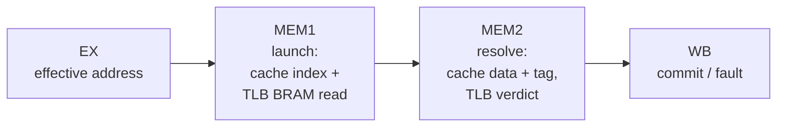

# Penumbra/3 — Memory stage & address translation (MEM1/MEM2)

> **Applies to:** Penumbra/3 · pipelined core (in design).

The gen3 data-memory access is split across two pipeline stages, MEM1 and
MEM2, and address translation rides that split: the TLB read launches in
MEM1 and its verdict resolves in MEM2. This document specifies the stage
contract, the duplicated-BRAM TLB that the split makes possible, and the
MEM2 verdict cone — the timing-critical compare that [Phase-0 probe
P0.3](./phase0-probes.md) measures.

It builds on the rules in [`timing-outline.md`](./timing-outline.md)
(the memory-stage and MMU/TLB sections) and the pipeline shape in the
[overview](./overview.md). The architecturally-visible MMU contract — the
software-managed TLB, the sysreg interface, and commit-time fault
registers — is unchanged from earlier generations and is **not** restated
here; see the [MMU & TLB reference](../../system/mmu.md).

## Why two memory stages

gen2 used a single MEM stage and paid a one-cycle stall on every load and
store that touched the D-cache (~0.35 CPI), because a BRAM cache is a
two-cycle launch/resolve and a single stage cannot pipeline it. It also
forced the TLB into async distributed-RAM: a synchronous BRAM TLB read had
no stage to land in, so its registered output arrived too late for a
same-cycle verdict.

Splitting MEM solves both at once:

- **Loads pipeline** — one access launches while the previous resolves, so
  back-to-back loads cost no per-op bubble.
- **The BRAM TLB gets its cycle** — the synchronous read launched in MEM1
  has its registered output ready in MEM2, exactly when the verdict is
  formed. This is what lets gen3 use a BRAM TLB where gen2 had to fall back
  to async LUTRAM.

One restructure, both wins.

## Stage contract

| Stage | Inputs (registered) | Work | Outputs (registered into next) |
|---|---|---|---|
| **MEM1** | effective address (from EX), access type, store data | drive the D-cache index, launch the TLB BRAM read (D-copy), drive the pinned-TLB lookup | vaddr, access type, store data, in-flight access valid |
| **MEM2** | vaddr, TLB BRAM read output, pinned-TLB output, cache tag/data | tag compare + way select; TLB hit-detect + permission verdict; assemble paddr; sub-word extract | load result or `load_pending`, paddr, fault verdict |
| **WB** | result / fault | commit; latch fault registers on a fault | architectural state final |

The **only** signal that crosses backward from MEM2 is the registered
load-completion / fault verdict consumed by the back-end stall logic — not
a combinational cache/TLB result reaching into issue (see the
[load-completion rule](./timing-outline.md)). MEM1/MEM2 never expose a
combinational busy into the spine.

## Address translation: the duplicated BRAM TLB

### Unified architecture, duplicated storage

The TLB is **one TLB to software**: a single entry set, a single miss
handler, a single sysreg interface — the kernel-sanity property the port
depends on. Internally the storage is **duplicated** into an I-copy and a
D-copy:

- The two copies serve the two independent read ports — instruction fetch
  (front end) and data access (MEM1) — without arbitration or a dual-read
  BRAM.
- They are **hardware-coherent**: every write — a TLB-miss refill, an
  invalidate, or a sysreg install — fans out to **both** copies in the same
  cycle, so they never disagree. Reads are independent.

Cost is 2× a tiny array, which the EBR budget easily absorbs; the win is
that each read port is a plain single-read BRAM.

### Synchronous read across MEM1/MEM2

Each copy is a synchronous BRAM: the index (from the vaddr) is driven in
MEM1 and the entry (tags + PTEs for the indexed set, all ways) is
registered out in MEM2. Hit-detect and the permission check then run on
that **registered** output — a short cone off a flop, not gen2's
async-LUTRAM read-plus-compare in the launch cycle.

### Storage budget

A copy needs **1 read port + 1 write port** (the write serves refill /
invalidate / sysreg install). One read + one write is a true dual-port
BRAM — a single DP16KD per copy. Associativity stays modest (2-way); the
duplication plus the sync read are what make 2-way fit cleanly without a
multi-read structure.

### The pinned TLB

The generation-neutral [`tlb_pinned`](../../../hw/rtl/common/tlb_pinned.sv)
(8-entry fully-associative, **pinned-hit-wins**) is reused unchanged from
`common/`. It holds the always-resident mappings (the vector page, the boot
region) and is async, so its lookup resolves combinationally in MEM2 on the
registered vaddr, in parallel with the main-TLB verdict. A pinned hit
overrides the main-TLB result. It is part of the MEM2 cone and so is
included in the P0.3 fanout.

### Software interface unchanged

Duplication and the MEM1/MEM2 split are microarchitecture only. A sysreg
TLB write (the kernel's miss handler installing a PTE via `WRSYS`) targets
the one architectural entry and the hardware mirrors it into both copies.
The kernel sees the same TLB it always has; this re-pipelining is
kernel-invisible.

## The MEM2 verdict cone

This is the timing-critical compare and the piece [P0.3](./phase0-probes.md)
exists to measure: after the **5.8 ns BRAM Tco**, the remaining logic +
routing must fit the period's budget (~14 ns at the 50 MHz target).

The verdict module consumes, all registered into MEM2:

- the main-TLB read output for the indexed set: the tag and PTE of **each
  way**;
- the pinned-TLB lookup result (hit + PTE);
- the access vaddr, the access type (`R` / `W` / `X`), and the privilege
  level (supervisor vs user).

and produces:

- **hit** — a way matched (or a pinned hit);
- **paddr** — the matching PTE's frame composed with the page offset;
- **fault** — a TLB miss (no way matched, no pinned hit) **or** a
  permission violation (the matched PTE does not grant the access type at
  the current privilege).

The two halves of the cone:

1. **Hit-detect** — per-way tag compare against the vaddr's VPN + valid,
   OR'd with the pinned hit; selects the matching PTE (the way mux).
2. **Permission verdict** — the matched PTE's permission bits vs the access
   type and privilege → permit or fault.

The permission half is the self-contained piece to implement against this
contract; the hit-detect/way-select and the BRAM storage around it are the
surrounding wiring.

## Fault contract (commit-time)

A translation fault does not redirect from the translate path. The fault
verdict rides the access to WB; on commit, the fault registers (`FADDR` /
`FSTAT`) latch and the precise fault is taken — the same commit-time
contract earlier generations already honor, so re-pipelining the translate
is invisible to the handler. Faults stay precise by the in-order,
single-outstanding invariant: the faulting access is the oldest in flight
when its verdict lands.

## What P0.3 proves

P0.3 wires MEM1 (index + TLB read launch) and MEM2 (tag compare + the
verdict cone above) with realistic fanout — both TLB copies, the pinned
TLB, the 2-way compare and way mux — and checks that the cone from the
registered BRAM output to the registered verdict closes at 50 MHz within
the ~14 ns post-Tco budget. A pass earns back the BRAM TLB; a fail forces a
structural decision (associativity, or accepting an async-LUTRAM TLB and
its cone) made now rather than mid-build.

## Open parameters

Settled when the RTL lands, not load-bearing for the contract above:

- **Entry count** per copy (gen2's main TLB carried 64 entries 2-way; gen3
  starts there and tunes if the BRAM geometry or miss rate argues
  otherwise).
- **Index function** (which vaddr bits select the set) — chosen with the
  cache index so the two BRAM reads launch from the same MEM1 address path.
