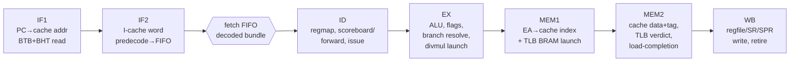

# Penumbra/3 — Overview & Build Plan

> **Applies to:** Penumbra/3 · pipelined in-order core (in design).

Penumbra/3 is a **fresh redo of the gen2 in-order pipeline**,
re-architected to clear the timing floor that capped gen2. It is **not**
superscalar and **not** out-of-order — it is the same single-issue,
in-order, classic-RISC machine, rebuilt so that every inter-block
boundary is a registered handshake and no cross-module combinational cone
survives to become a structural ceiling.

This document is the entry point for gen3: what it is, why it exists, the
fork boundary against the shared system, the pipeline shape, the feature
set, and — most importantly — the **build plan**, whose ordering is the
direct lesson learned from how gen2 dead-ended.

Companion: [`timing-outline.md`](./timing-outline.md) is the
structural-rules research (Rule Zero and the per-subsystem design points)
this plan is built on. Read it alongside this document; this overview does
not restate its rules in full.

## Why a third generation

gen2/2.5 is [abandoned](./../penumbra2/overview.md). It reaches **37.5 MHz**
on the ULX3S ECP5 only after a closure round stripped it back, with no
headroom left for its own remaining features. The limiter is not placement
— it is the **D-side memory-hit cone**: an in-order pure-stall machine
requires the cache hit verdict to gate commit *the same cycle*, so
`D-cache tag compare → busy → stall network → commit` is one combinational
path spanning the die (~29 ns, ~34 MHz floor), and the same cone reappears
on the MMU verdict and the load-use freeze. Floorplanning cannot shorten a
cross-module combinational path.

**The gen2 mistake gen3 must not repeat.** gen2 wired those boundaries
combinationally as "register them later," built the whole machine on top,
and only discovered at closure that the cone was a *structural* floor —
unfixable without rewriting the pipeline that now depended on it. The
microarchitecture to fix it already exists (the timing outline). What gen3
adds is **discipline of sequencing**: prove the hard structural claims hold
at the target clock, on realistic context, *before* building on them. That
discipline is the [build plan](#build-plan) below.

## What gen3 is — and is not

| | |
|---|---|
| **Is** | Single-issue, in-order, 7-stage pipelined RISC. Same ISA, ABI, exception model, and bus contracts as gen1/gen2. Boots the same NetBSD binary (CPUID-discriminated). |
| **Is not** | Superscalar, out-of-order, multi-issue, or speculative beyond fetch-time branch prediction. Those stay out of scope (a hypothetical gen4's territory). |
| **Target** | A **reliable** 50 MHz on the −6 ULX3S ECP5 *with margin* — built toward until proven *structurally* (not placement-) difficult, then a **reliable** 37.5 MHz with headroom is the accepted fallback. Never a barely-closing 50. |

The discrete-logic constraint does **not** apply: like gen2, gen3 is
FPGA-only (BRAM caches, wide registered datapaths). Only gen1 and the ISA
honor 74xx feasibility. What gen3 still honors is the externally-visible
ISA contracts — bus protocol, autoconfig, the device sysreg interface —
because those are ISA-level, shared by every generation.

## The four structural changes (the thesis)

From the [timing outline](./timing-outline.md); everything else is
hygiene around these:

1. **Registered load-completion back-end.** The pipeline gate moves from
   the live cache `busy` to a registered `load_pending` flop; a miss parks
   the load in a one-entry hold buffer and completes on a registered event
   (`{data}` or `{fault}`). This deletes the gen2 floor cone — both the
   load-use freeze and the MMU-verdict path, which are the same cone.
   Faults stay precise by the in-order single-outstanding invariant.
2. **Registered decode→issue boundary.** The fetch FIFO presents a
   *pre-decoded control bundle*, not a raw word — the heavy word→bundle
   decode runs at FIFO enqueue (fetch-domain slack), so ID's cone starts
   from registered fields. The hazard/forward compare then runs on
   already-registered register numbers (the shape every surveyed core uses;
   never a 25 ns path). Regmap stays in ID on live supervisor mode.
3. **CPU↔bus transaction decouple (Amiga model).** A registered
   line-transaction request out, streamed response back through a fill
   buffer; the cache hides bus latency and the CPU clock is independent of
   bus speed. Memory stays a first-class autoconfig bus device — the async
   4-phase protocol is preserved *for peripherals*.
4. **Split MEM1/MEM2 + duplicated BRAM TLB + L2 burst fill.** Pipelines
   loads (kills gen2's ~0.35 CPI per-op bubble), gives the sync BRAM TLB
   the cycle it needs (launch in MEM1, verdict in MEM2), and makes L2 fills
   cost per-line not per-word — all interlocking.

## Pipeline shape

7 stages; pre-decode folds into the fetch-FIFO enqueue (no extra stage).

| Property | gen3 |
|---|---|
| Stages | 7 (IF1, IF2, ID, EX, MEM1, MEM2, WB) + elastic fetch FIFO |
| Hazards | Full operand forwarding (EX→EX, MEM2→EX) + NZCV flag forwarding; scoreboard interlock for the residual cases |
| Branches | Resolve in EX; fetch-time BTB → 0 bubbles on correct taken-prediction; cold/mispredict = registered flush |
| Load-use | ≈1–2 cycles with MEM2→EX forwarding (pinned in the pipeline-stages doc) |
| Loads | Single-outstanding, hold-and-complete (no per-op MEM bubble) |
| divmul | Side FU (reused `common/divmul.sv`), registered completion, dual-write sequenced over two WB cycles |
| Serializing ops (WRSYS/ERET) | Serialize + registered flush/redirect at commit; default serialize *every* WRSYS |

## Fork boundary

gen3 is a full `CORE=penumbra3` generation (like gen2 forked from gen1),
**not** a `penumbra2_5`-style composition sub-variant. It gets its own core
*and its own on-chip memory hierarchy*, because registering every
inter-block boundary is the whole thesis — and those boundaries are exactly
the L1/MMU/arbiter/fill/L2 modules gen2 *shared*. gen1 and gen2 stay
byte-frozen and re-synthesizable; gen3 only adds files.

The fork is **deeper than gen2's**: gen2 forked only the pipeline + L1 and
shared L2/MMU storage; gen3 forks the entire machine guts down to the
registered bus master. The seam is the **machine layer** — `machine_penumbra3`
keeps `machine_penumbra2`'s external port list byte-identical (a generic
master bus + IRQ + trace + program-end), so the board top is a near-verbatim
copy and the board never learns gen3 exists.

| Disposition | Modules |
|---|---|
| **Reuse as-is (generation-neutral leaf)** | `common/penumbra_pkg.sv` (ISA/system contract), `common/divmul.sv` (MUL/DIV peer FU), `common/cond_eval.sv`, `common/byte_ext.sv`, `common/byte_rep.sv`. `common/tlb_pinned.sv` = reuse-candidate, revisit under the MMU rewrite. |
| **Reuse as-is (bus devices + board)** | `soc/`: `boot_rom`, `busctl`, `cpuid`, `machid`, `timer`, `autoconfig_dev`, `bus_devsel`, `cache_perfctr`. All of `io/` (UART, SPI, **SDRAM controller stack**, video). The `fpga/ulx3s` PLL + shell. |
| **Fork & rewrite → `penumbra3/` (pipeline)** | core, spine, IF1/IF2/fetch_buffer/ID/EX/MEM1/MEM2/WB, decode, regmap, alu, regfile, scoreboard, flag_bypass, spr_file, scratch_file, irq, vecfetch, perfctr, pkg |
| **Fork & rewrite → `penumbra3/` (memory hierarchy — the boundaries Rule Zero registers)** | MMU + TLB storage (duplicated BRAM I/D, MEM1-launch/MEM2-verdict), L1 (write-through, hit→registered-replay), arbiter + CPU↔bus decouple (registered line-transaction), fill sequencer (burst), L2 (`soc/l2_cache.sv` → `penumbra3_l2.sv`; **initial write-through, write-back/write-allocate a later isolated upgrade — outside the core cones**) |
| **New thin wrappers** | `machine/machine_penumbra3.sv` (port list identical to gen2), `fpga/ulx3s/ulx3s_penumbra3_top.sv` (copy of gen2 top, swap the machine instance) |

**Known sharp edge.** Registering the L2↔bus boundary in gen2 tripped a
suspected **SDRAM-adapter deadlock on gapped reads** (`test_l2_ifetch`
hung). gen3's registered burst fill is the centerpiece, so it must issue
clean back-to-back bursts the existing `sdram_bus_adapter` tolerates, or
that adapter takes a (shared) fix. This is the one place "reuse `io/`
as-is" carries a real risk — and it is a Phase-0 probe.

## Feature set: what's foundational vs staged

**Foundational — designed in from the start.** Forwarding and the BTB are
*not* additive: the gen2 post-mortem is explicit that forwarding + branch
prediction reshape the EX/MEM/stall/commit region, which is exactly the
floor. Designing that region without them means optimizing a tail that gets
rewritten. So the Phase-1 skeleton already carries full operand forwarding,
flag forwarding, and the registered load-completion back-end; the BTB lands
right behind it.

**Staged — additive, outside the core cones.** RAS (fetch-domain return
prediction, small payoff) and the entire store-traffic optimization
(write-back L2, plus a store buffer only if measurement justifies it)
reshape nothing in the core's critical cones, so they follow the booting
skeleton. The store-traffic strategy is detailed below — it is deliberately
*not* a reserved core seam, because the better answer (write-back L2) lives
outside the core entirely.

### Store-traffic strategy — write-back L2 first, store buffer only if it earns it

Store performance has two distinct costs, and they are not equally
important:

- **Write throughput** — the sustained rate stores can be absorbed. This is
  what real software is bound by (a write-through-to-SDRAM path spends the
  bulk of a store-heavy run just moving writes to memory).
- **Write latency** — how long an individual store takes. In an in-order
  machine a store produces no register result, so latency only stalls the
  core when a buffer fills or a younger load / uncached-store waits on a
  drain.

A **store buffer** mostly hides *latency* (and helps throughput only if it
coalesces); measured at 25 MHz its payoff was modest, because the binding
cost was throughput, not latency. **Write-back / write-allocate L2** attacks
*both*: stores are absorbed on-chip (dirty), only evictions reach SDRAM, so
sustained throughput jumps and each store also completes at L2-hit latency.
It is therefore the primary store-traffic optimization — and, critically, it
lives **entirely outside the CPU core timing cones** (post-L1, on the bus
side), so it can be added or swapped without perturbing core fmax. That
makes it the rare optimization it is *safe to defer* (see the
[deferral principle](#build-plan)).

So gen3 does **not** build a store buffer up front, and does not reserve a
disambiguating-buffer seam in the core:

- **Phase-1 store-completion model: blocking write-through, WnA.** A store
  writes through L1-D to L2 and the core waits for the ack. Correct and
  simple; with a write-through L2 early it is slow-but-correct, and because
  the cost is a *stall* (CPI), not a combinational path (fmax), it is safe
  to leave until the L2 upgrade. No store buffer, so no load disambiguation:
  a later load misses WnA L1-D and fills from L2, which already holds the
  completed store.
- **Write-back L2 (later phase) makes each blocking write-through cheap**
  (L2-hit) and eliminates the SDRAM round-trips — the actual win.
- **A store buffer is a measure-driven option, not a plan item.** Only if
  profiling *after* write-back still shows the residual per-store L2-hit
  stall binding under sustained stores would a minimal posted-write decouple
  (not a full disambiguating buffer) be added. The 25 MHz data suggests it
  will not be needed.
- **L1-D write-allocate stays off the table for now.** Its allocation logic
  is complex and sits in the most critical timing cones, so it is a real
  fmax risk; investigate only once the basic design closes. Keep WT-WnA.

Whatever store path lands, the ordering contract is unchanged and rides
existing ops: uncached stores are ordered (a DMA kickoff is an uncached MMIO
store), so no new ISA barrier is introduced.

## Performance targets

Targets, not measurements — actuals get recorded in `benchmark/` once gen3
runs on hardware.

| Metric | gen3 target | Reference |
|---|---|---|
| Fmax | reliable 50 MHz w/ margin; reliable 37.5 fallback | gen2 topped at barely-37.5 |
| CPI, cache-hot tight loop | ~1.1–1.3 (forwarding from day one) | gen2 ~2.5–3.0 unforwarded |
| CMP+Bcc heavy | ~1.0–1.1 (flags forwarded, BTB) | — |
| L1 size | ≥16 KB | gen2 4 KB (then 2-way) |
| Load-use stall | 1 (forwarded) | gen2 4 |
| Taken-branch bubbles | 0 predicted / full flush cold | gen2 3 |

## Build plan

The ordering is the point. Each phase's structural prerequisite was proven
in Phase 0; nothing is built on an unproven cone. fmax is always read on
the **full top**, never on a bare-core probe (a bare cone over-reports — the
project has measured ~55 vs ~31 MHz between the two).

**The deferral principle.** The anti-dead-end rule applies to *timing cones*
— combinational boundaries that set fmax. Those are proven in Phase 0 and
never deferred. It does **not** apply to *cycle-count* perf that lives
outside the core cones (store throughput, L2 policy): that is always safe to
defer, because improving it later never forces a core rewrite. gen2's fatal
error was conflating the two — it deferred a *structural boundary* as if it
were a perf knob. gen3 keeps them separate: defer freely outside the cones,
never inside them.

### Phase 0 — structural feasibility probes (the gate)

Prove the four load-bearing claims close at *reliable 50 with margin*, each
wired with realistic fanout on both sides of the boundary (not bare cells).
Full per-probe specs — RTL to build, exact path to measure, pass threshold,
decision-on-fail — are in [`phase0-probes.md`](./phase0-probes.md).

| Probe | What it proves |
|---|---|
| P0.1 registered load-completion | `MEM2 hit/miss → registered load_pending → issue/scoreboard gate` is short; the gen2 busy→issue and busy→MMU floor cones are gone |
| P0.2 registered decode→issue | `pre-decoded FIFO slot → regmap → scoreboard/forward compare → issue` starts from flops and fits |
| P0.3 split MEM + BRAM TLB | MEM1-launch / MEM2-verdict absorbs the 5.8 ns BRAM Tco + tag/permission compare in the period |
| P0.4 CPU↔bus burst + SDRAM survival | registered line-transaction into the **real `sdram_bus_adapter`** streams without the gapped-read deadlock |

**Gate rule (the anti-dead-end rule).** If a probe is structurally short of
reliable-50, decide *at that probe* — redesign the boundary, or consciously
accept 37.5 for that path with the headroom documented. Never "wire it up
and fix later." A path that only closes on 1-of-N seeds is not a close.

### Phase 1 — correctness skeleton (boots conformance)

Full 7-stage pipeline using the proven boundaries: registered
load-completion, decode-on-enqueue, full operand + flag forwarding,
single-outstanding hold-buffer loads, static-not-taken branches resolved in
EX (no BTB yet), write-through L1 + **write-through L2** + burst read-fill +
registered bus. **Store path: blocking write-through, WnA** — no buffer, no
disambiguation; slow-but-correct, and a stall (CPI) outside the core cones,
so safe to leave for the Phase-4 L2 upgrade. divmul reused from `common/`.
**Exit:** `isa/` conformance passes on the gen3 RTL runner.

### Phase 2 — BTB (+ optional RAS)

Fetch-time direct-branch BTB (0-bubble correct taken-prediction); optional
fetch-domain RAS for returns. Re-run conformance + gen3 microarch
regressions; re-read full-top fmax.

### Phase 3 — NetBSD boot

Boot the kernel (same binary, CPUID-discriminated). Core is feature-complete
(forwarding + BTB) and correctness-validated against a real OS before perf
work begins.

### Phase 4 — L2 write-back / write-allocate (store-traffic perf)

The primary store-traffic optimization, and the one that lives entirely
outside the core timing cones — so it lands here, late, with no risk to the
core fmax proven in Phase 0. Absorbs stores on-chip; only L2 evictions reach
SDRAM. A store buffer is added *only* if profiling after this still shows the
residual per-store L2-hit stall binding (the 25 MHz data suggests it will
not). L1-D write-allocate is investigated here at the earliest, and only if
it can be shown not to lengthen the critical cone.

### Phase 5 — floorplan + clock

The **one-time** floorplan pass that converts structural headroom into the
operating clock — floorplan once, after all features land, never
per-feature. Set the PLL step (50 or reliable-37.5) from the full-top fmax
with margin.

## Reading guide

1. **This document** — overview + build plan (you are here).
2. [`timing-outline.md`](./timing-outline.md) — the structural
   rules (Rule Zero, per-subsystem design points) this plan rests on.
3. [`mem-stage.md`](./mem-stage.md) — the MEM1/MEM2 memory stage and the
   duplicated BRAM TLB (the first per-area spec).
4. Further per-area gen3 specs — *to be written as each subsystem is
   designed* (design-decisions, pipeline-stages, hazard-model,
   memory-interface), following the gen2 doc layout under `penumbra2/`.

For the system the gen3 core attaches to but does not change — ISA, ABI,
exception model, bus protocol, autoconfig, peripherals — the
[documentation index](../../README.md) (system reference + shared
internals) remains the source of truth.
