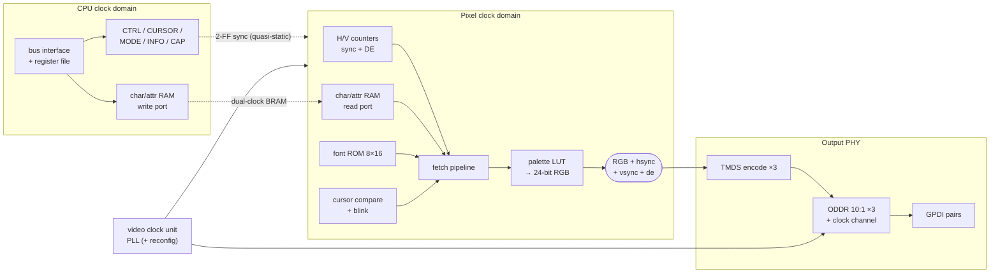

# Penumbra Text-Video Console — FPGA Microarchitecture

> **Applies to:** the FPGA (ECP5 / GPDI) implementation of
> `CLASS_TEXTVIDEO`. Generation-independent — the console attaches to the
> system bus like any autoconfig device, so both cores drive it
> identically. The programmer-visible contract is
> [text-video.md](../system/devices/text-video.md); this document
> describes one hardware realization of it.

## Overview

The console renders a grid of character cells to a GPDI (DVI/HDMI)
output. It splits cleanly into two parts:

- a **pixel generator** — timing, cell/font fetch, attribute-to-color —
  emitting a parallel RGB + sync stream. This is classic character-display
  logic (the CGA/MDA lineage) and is discrete-logic feasible.
- an **output PHY** — TMDS encode and serialize — driving the GPDI
  differential pairs at the TMDS bit rate. This is FPGA-only.

The seam between them is a standard parallel-RGB interface — the
[discrete-swap point](#discrete-logic-boundary).

## Block Diagram

## External Interface

| Signal                          | Direction | Purpose                                              |
|---------------------------------|-----------|------------------------------------------------------|
| `i_clk`, `i_rst`                | in        | System clock / reset — bus interface and registers   |
| `i_addr`, `i_wdata`, `i_we`, `i_re` | in    | Device bus request (word-strided)                    |
| `o_rdata`                        | out       | Device bus read data                                 |
| `o_busy`                         | out       | One-cycle registered-read stall                      |
| `i_pixel_clk`                    | in        | Pixel clock for the active mode                      |
| `i_serial_clk`                   | in        | 5× pixel clock for the TMDS serializers             |
| `o_gpdi_dp[3:0]`, `o_gpdi_dn[3:0]` | out    | GPDI pairs: `[2:0]` R/G/B data, `[3]` clock          |

The video clocks are inputs, supplied by a separate **video clock unit**
(PLL, plus the reconfiguration FSM in the full design). Keeping them out
of the generator lets it be simulated with any clock source and keeps the
clocking strategy swappable.

## Character / Attribute RAM

A dual-clock, dual-port block RAM. The write port lives in the CPU clock
domain and takes stores into the `CELLS` aperture; the read port lives in
the pixel clock domain and is addressed by the scan-out pipeline. Because
the ports are independent, a CPU write becomes visible on the next scan
that reads the cell — there is no coherency handshake, and a text console
needs none. Each cell is 16 bits (`{glyph, attribute}`); the array is
sized for the largest supported mode's `COLUMNS × ROWS`.

## Font ROM

A single-port block RAM, 256 glyphs × 16 rows × 8 bits = 4 KiB,
initialized at synthesis via `$readmemh` from a VGA-style 8×16 glyph
table. Addressed by `{glyph, glyph_row}`, it returns one 8-pixel row,
from which `glyph_col` selects a single foreground/background bit.

## Scan-out Pipeline

The timing generator is a pair of free-running counters (horizontal,
vertical) on the pixel clock, producing `hsync`, `vsync`, blanking, and a
data-enable (`de`) marking active pixels. From the active `(x, y)` — where
the `/8` and `/16` are just bit slices, since the cell is a power of two:

- `char_col = x[..3]`, `glyph_col = x[2:0]`; `char_row = y[..4]`, `glyph_row = y[3:0]`
- **Stage 1** — read char/attr RAM at `char_row × COLUMNS + char_col`
- **Stage 2** — read font ROM at `{glyph, glyph_row}`
- **Stage 3** — select font bit `[glyph_col]` → pick the `FG` or `BG` nibble
- **Stage 4** — palette LUT (16 × 24-bit) → R/G/B

`hsync`/`vsync`/`de` pass through matching delay registers so they line up
with the pixel they describe. The cursor unit compares `(char_col,
char_row)` against the `CURSOR` register and, when `CTRL.CURSOR_EN` is set
and the blink counter is in its on-phase, forces the cell to inverse — a
comparator plus a counter, no memory.

## Output PHY (TMDS)

During active video each 8-bit color channel is TMDS-encoded to 10 bits
(transition-minimized, then DC-balanced); during blanking the encoder
emits the control-period codes that carry `hsync`/`vsync` on the blue
channel. The three 10-bit words, plus the clock channel's fixed
`0b0000011111` pattern, are serialized LSB-first at the TMDS bit rate
(10× pixel) using ECP5 DDR output registers (`ODDRX`, two bits per serial
clock at 5× pixel) — the same primitive family the SDRAM PHY uses. The
four serial streams drive the GPDI pairs as `LVCMOS33D` pseudo-differential
outputs.

## Clock Domains

Three clocks:

- **system/CPU clock** — bus interface, registers, char-RAM write port.
- **pixel clock** — timing, fetch, char-RAM read port, palette.
- **TMDS serial clock** = 5× pixel — the `ODDR` serializers.

The char/attr RAM bridges CPU↔pixel as a dual-clock BRAM. The few control
values the pixel domain consumes (`ENABLE`, cursor position, active
geometry) change rarely and cross via 2-FF synchronizers, treated as
quasi-static — at worst a torn cursor update misplaces the cursor for one
frame. The video clocks come from a dedicated PLL, separate from the
system/SDRAM PLL; the ECP5-85F has spare PLLs for it.

## Display Modes and Clocking

A mode is a `{columns, rows}` geometry (the contract's view); the
generator maps it to a pixel resolution and font internally:

| Mode | Geometry | Resolution / font | Pixel clk | Serial clk |
|------|----------|-------------------|-----------|------------|
| 0    | 80×30    | 640×480 / 8×16    | 25.175 MHz | ~126 MHz  |
| 1    | 100×37   | 800×600 / 8×16    | 40 MHz     | 200 MHz   |

Because each resolution has its own pixel and serial clock with no clean
shared ratio, switching modes means regenerating both. The full design
does this through the PLL's dynamic reconfiguration port: a write to
`MODE_SEL` triggers an FSM that rewrites the PLL divider settings for the
target mode, waits for relock, and restarts the timing generator. Cell
contents are undefined across the switch (the aperture stride changes with
`COLUMNS`), so the driver re-initializes — matching the contract.

## Discrete-Logic Boundary

The parallel-RGB stream (`R, G, B, hsync, vsync, de` at the pixel clock)
is the seam. Everything upstream — counters, cell/font fetch, palette,
cursor — is the lineage of the discrete character-display card and is
reproducible in 74xx logic: counters, a character RAM, a font ROM, a
shift register for the glyph row, and a small mux. Everything downstream
— TMDS encode and 10× serialization — cannot be done in 74xx (it is a
multi-hundred-Mbit/s serial line code) and is intentionally FPGA-only. A
future discrete build replaces only the PHY: the parallel RGB drives a
resistor-ladder DAC and the sync signals go to a VGA connector, generator
unchanged. This honors the project rule that the core must be
discrete-feasible while a peripheral's high-speed PHY need not be.

## Implementation Status

- **First build (target A)** — a single fixed mode 0 (640×480 / 80×30),
  fixed video PLL, no reconfiguration, `CAP.MODESWITCH = 0`: a conformant
  single-mode `CLASS_TEXTVIDEO` device and the fastest path to a picture
  on a monitor.
- **Goal (C)** — add the PLL reconfiguration FSM and mode 1 (800×600 /
  100×37) so the OS can switch to the larger console after boot, with
  mode 0 remaining the power-up mode. The contract and driver are
  unchanged between the two; only the device's mode table and the clock
  unit grow.
- Not yet implemented.

## See Also

- [text-video.md](../system/devices/text-video.md) — programmer contract
- [bus.md](../system/bus.md) — autoconfig and the `CLASS_TEXTVIDEO` class
- [usb-host.md](../system/devices/usb-host.md) — the `wskbd` half of a
  `wscons` local console
