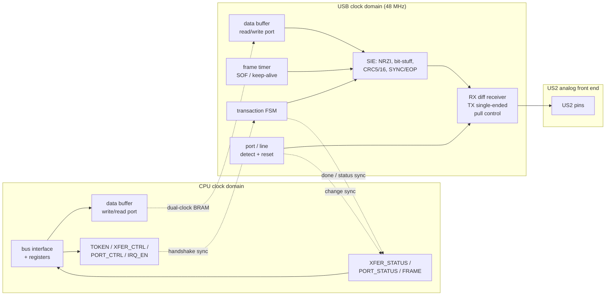
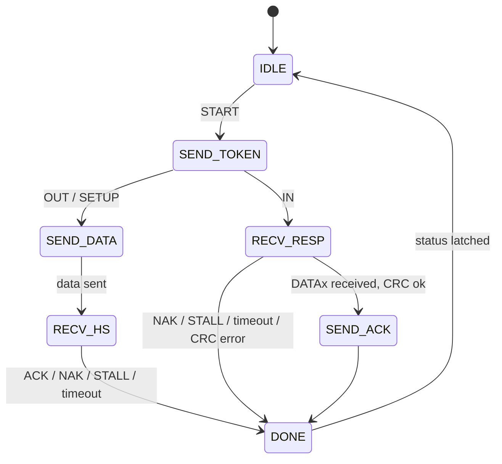

# Penumbra USB Host Controller — FPGA Microarchitecture

> **Applies to:** the FPGA (ECP5 / ULX3S US2 port) implementation of
> `CLASS_USBHC`. Generation-independent — the controller attaches to the
> system bus like any autoconfig device. The programmer-visible contract
> is [usb-host.md](../system/devices/usb-host.md); this document describes
> one hardware realization of it.

## Overview

The controller realizes the transaction-level `CLASS_USBHC` minimum
protocol. The hardware/software split is forced by USB timing:

- **Hardware** does the line-rate, turnaround-critical work — a serial
  interface engine (SIE) that encodes/decodes one transaction (token,
  optional data packet, handshake) atomically, a 1 ms frame timer, and
  the downstream-port line logic.
- **Software** (the NetBSD host-controller driver, or the boot ROM) does
  everything schedulable — sequencing transactions, device enumeration,
  and root-hub emulation.

The boundary is exactly one transaction: hardware cannot meet USB's
inter-packet turnaround if a CPU sits in the handshake loop, but anything
coarser than a single transaction is software's job.

## Block Diagram

## External Interface

| Signal                          | Direction | Purpose                                            |
|---------------------------------|-----------|----------------------------------------------------|
| `i_clk`, `i_rst`                | in        | System clock / reset — bus interface and registers |
| `i_addr`, `i_wdata`, `i_we`, `i_re` | in    | Device bus request (word-strided)                  |
| `o_rdata`                        | out       | Device bus read data                               |
| `o_busy`                         | out       | One-cycle registered-read stall                   |
| `o_irq`                          | out       | Interrupt (XFER_DONE / PORT_CHANGE / SOF)         |
| `i_usb_clk`                      | in        | 48 MHz engine clock                               |
| `i_dp`, `i_dn`                   | in        | D+/D- differential receive                        |
| `o_tx_dp`, `o_tx_dn`, `o_tx_oe` | out       | D+/D- single-ended drive + output enable          |
| `o_pull_dp`, `o_pull_dn`        | out       | Line pull-up/down control                         |

The line-side signals map to the ULX3S US2 pins in
[US2 Pin Wiring](#us2-pin-wiring).

## Serial Interface Engine (SIE)

The SIE runs on a dedicated **48 MHz** clock — 4× oversampling of
full-speed (12 Mbps), 32× of low-speed (1.5 Mbps). USB carries no
separate clock; the receiver recovers bit timing by oversampling and
locking to NRZI edges, and the line code's bit-stuffing guarantees a
transition at least every six bits so the sampler never drifts. The bit
period is selected from the detected port speed (÷4 full-speed, ÷32
low-speed).

The engine implements the standard line layer:

- **NRZI** encode/decode (a transition = 0, no transition = 1).
- **Bit-stuffing** — insert a 0 after six consecutive 1s on transmit,
  remove it on receive.
- **CRC5** for tokens and **CRC16** for data packets, as LFSRs checked on
  receive and appended on transmit.
- **SYNC** preamble generation/detection and **EOP** (single-ended-zero)
  framing.

## Transaction FSM

One transaction is a token packet, an optional data packet, and a
handshake, executed atomically:

`SEND_TOKEN` emits PID + device address + endpoint + CRC5 from `TOKEN`.
For `OUT`/`SETUP`, `SEND_DATA` streams the `DATA` buffer as a DATAx packet
with CRC16, then `RECV_HS` captures the device handshake. For `IN`,
`RECV_RESP` accepts either a DATAx packet (stored to the buffer, CRC
checked, then `SEND_ACK` returns ACK) or a NAK/STALL handshake. `DONE`
latches `XFER_STATUS` (`RESULT`, `RXLEN`) and raises `XFER_DONE`. The
host-side handshake in `SEND_ACK` is generated in hardware because it must
fall within the USB turnaround window.

## Frame Timer

A 1 ms counter on the USB clock keeps the bus alive while `PORT_CTRL.RUN`
is set: at full speed it emits an SOF token (incrementing frame number +
CRC5); at low speed it emits a keep-alive EOP. It advances `FRAME` and
raises the `SOF` interrupt, which software uses to pace periodic
(interrupt-endpoint) polling.

## Port and Line Logic

As a host, the controller drives the standard 15 kΩ pull-downs on D+/D-
through `o_pull_*`. A connected device's 1.5 kΩ pull-up then raises D+
(full-speed) or D- (low-speed); the port logic reports this as `CONNECT`
and decodes `SPEED` from which line rose. `PORT_CTRL.RESET` drives a
single-ended-zero bus reset (software-timed for the ≥10 ms hold), and the
raw J/K/SE0 line state is exposed in `PORT_STATUS.LINE`. These registers
are the substrate the software root hub manipulates.

## US2 Pin Wiring

The ULX3S US2 port reaches the FPGA on three pin groups, and the split is
deliberate: the primary pair is receive-capable only, so transmit uses
the bidirectional pair.

| Function     | Pins (signal / site)                          | Role                          |
|--------------|-----------------------------------------------|-------------------------------|
| Receive      | `usb_fpga_dp` / `usb_fpga_dn` (E16 / F16)     | Differential D+/D- input      |
| Transmit     | `usb_fpga_bd_dp` / `usb_fpga_bd_dn` (D15 / E15) | Single-ended D+/D- drive    |
| Pull control | `usb_fpga_pu_dp` / `usb_fpga_pu_dn` (B12 / C12) | Host pull-down enable       |

## Clock Domains and CDC

Two clocks: the system/CPU clock (bus interface, registers) and the
48 MHz USB clock (SIE, transaction FSM, frame timer, port logic). The
crossings:

- **Data buffer** — a dual-clock, dual-port BRAM: software fills/reads it
  on the CPU port, the SIE streams it on the USB port. No payload ever
  crosses through a synchronizer.
- **Control / status** — `START` (a `XFER_CTRL` write) crosses CPU→USB and
  `DONE` plus the latched `XFER_STATUS` cross USB→CPU through a req/ack
  handshake, so software only ever reads a settled result.
- **Events** — `PORT_CHANGE` and `SOF` are synchronized to the CPU domain
  to raise `o_irq`.

## Mapping to the NetBSD Host-Controller Driver

The register contract is shaped to fall straight onto the MI USB stack's
two vtables (`usbd_bus_methods`, `usbd_pipe_methods`), with NetBSD's
`dev/ic/sl811hs.c` — a register-level, software-scheduled single-port
controller — as the structural template:

- **Pipe transfer** (`upm_start`) decomposes a `usbd_xfer` into
  transactions. A control transfer becomes a SETUP transaction (write
  `DATA`, set `TOKEN`, write `XFER_CTRL`), an optional data stage, and a
  status stage; an interrupt-IN poll is a single `IN` transaction whose
  `NAK` result means "no new data."
- **Root hub** (`ubm_rhctrl`) is emulated in software over
  `PORT_STATUS`/`PORT_CTRL` — power, reset, connect/speed, enable — so the
  MI layer treats the controller's port like any hub port.
- **Xfer alloc / lock / poll** (`ubm_allocx`/`ubm_freex`, `ubm_getlock`,
  `ubm_dopoll`) are standard.

Enumeration, descriptor parsing, and HID handling stay entirely in the MI
layer above; the controller only moves packets. A `ukbd` keyboard
discovered this way drives `wskbd`, pairing with a
[text-video](text-video.md) console to form a `wscons` local console.

## Discrete-Logic Note

This is a peripheral, exempt from the core's discrete-feasibility rule —
which is just as well. The SIE's protocol logic (CRC LFSRs, the shift
register, the FSM) is 74xx-reproducible, but the line layer is not: NRZI
at 1.5/12 Mbps over differential signaling, with handshake turnaround
inside the USB inter-packet window, has no practical TTL form. A
discrete-era machine would reach for a synchronous serial keyboard
interface instead; USB host is intentionally an FPGA-and-beyond device.

## Implementation Status

- **First build** — low- and full-speed, control and interrupt transfers,
  a single directly-attached device: the `CLASS_USBHC` minimum, enough to
  enumerate and poll a boot-protocol HID keyboard through the NetBSD MI
  USB stack.
- **Extensions** — bulk and isochronous transfers, downstream-hub support
  (PRE/split), and a DMA transfer-descriptor engine are all `CFG_ID`
  features per the contract.
- Not yet implemented.

## See Also

- [usb-host.md](../system/devices/usb-host.md) — programmer contract
- [bus.md](../system/bus.md) — autoconfig and the `CLASS_USBHC` class
- [text-video.md](text-video.md) — the `wsdisplay` half of a `wscons`
  local console
