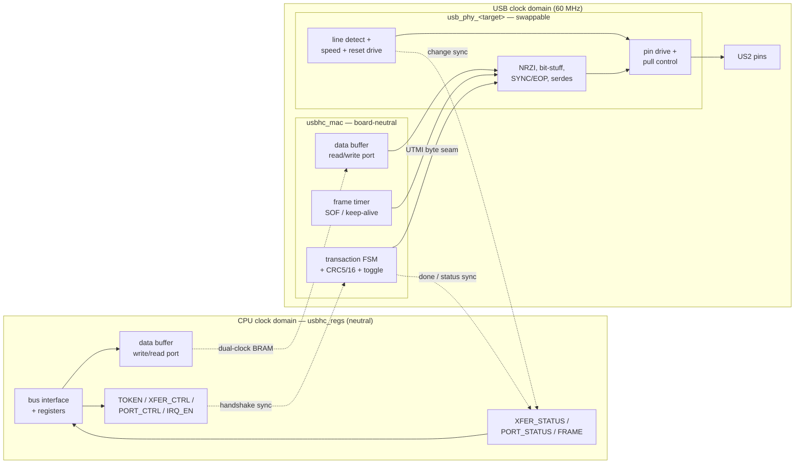
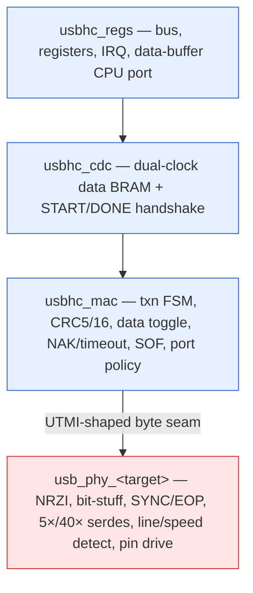
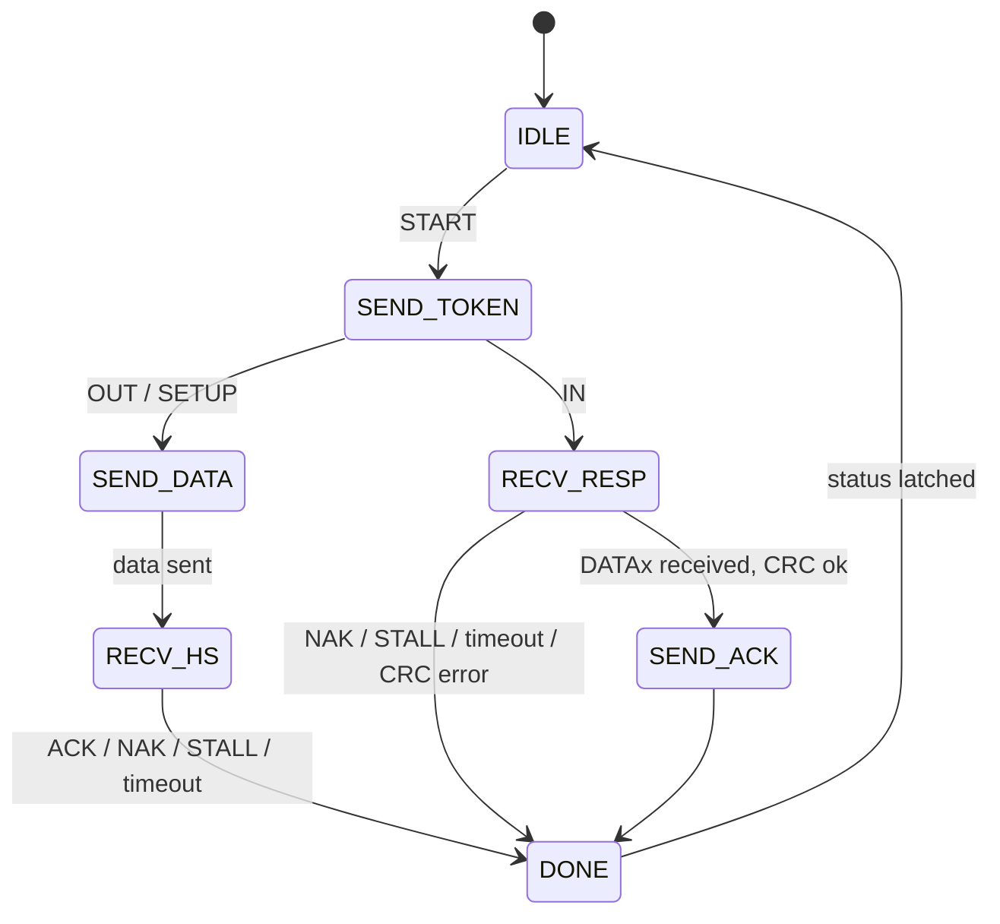

# Penumbra USB Host Controller — FPGA Microarchitecture

> **Applies to:** the FPGA (ECP5 / ULX3S US2 port) implementation of
> `CLASS_USBHC`. Generation-independent — the controller attaches to the
> system bus like any autoconfig device. The programmer-visible contract
> is [usb-host.md](../system/devices/usb-host.md); this document describes
> one hardware realization of it.

## Overview

The controller realizes the transaction-level `CLASS_USBHC` minimum
protocol. The hardware/software split is forced by USB timing:

- **Hardware** does the line-rate, turnaround-critical work — a MAC that
  sequences one transaction (token, optional data packet, handshake)
  atomically, a 1 ms frame timer, and a line-layer PHY (the serial
  interface engine, SIE) under it.
- **Software** (the NetBSD host-controller driver, or the boot ROM) does
  everything schedulable — sequencing transactions, device enumeration,
  and root-hub emulation.

The boundary is exactly one transaction: hardware cannot meet USB's
inter-packet turnaround if a CPU sits in the handshake loop, but anything
coarser than a single transaction is software's job.

The hardware is itself layered at the **UTMI boundary**: a board-neutral
**MAC** (transaction FSM, CRC, data toggle, frame timer, port policy)
above a **swappable PHY** (NRZI, bit-stuffing, SYNC/EOP, oversampling
serdes, and the analog line drive). A board with an external USB PHY
reuses the entire MAC and replaces only the PHY — see
[Module Decomposition & Portability](#module-decomposition--portability).

## Block Diagram

## Module Decomposition & Portability

The controller is built as four modules across two reuse tiers, cut at
the **UTMI boundary** — the same MAC/PHY line the USB standard draws.
Everything from CRC upward is board-neutral; NRZI, serdes, and the analog
line drive live in a swappable PHY. A board with an external USB PHY
reuses the whole stack above the seam and replaces only the PHY, exactly
as the SDRAM stack swaps `sdram_phy_ecp5` for `sdram_phy_sim`.

| Module | Role | Tier | SDRAM analog |
|--------|------|------|--------------|
| `usbhc_regs` | Bus interface, registers, IRQ, data-buffer CPU port | board-neutral | `sdram_bus_adapter` |
| `usbhc_cdc` | Dual-clock data BRAM + START/DONE handshake (CPU↔USB) | board-neutral | `sdram_cdc` |
| `usbhc_mac` | Transaction FSM, CRC5/16, data toggle, NAK/timeout, frame timer/SOF, port policy | board-neutral | `sdram_ctrl` |
| `usb_phy_<target>` | NRZI, bit-stuffing, SYNC/EOP, oversampling serdes, line/speed detect, pin drive + pull control | **swappable** | `sdram_phy_<target>` |

**Swap scenarios.** Only the PHY changes between targets:

- **`usb_phy_ecp5`** — native low-/full-speed on the ULX3S US2 pins; NRZI
  and serdes in fabric, analog drive on the raw D+/D- lines.
- **`usb_phy_sim`** — testbench PHY; the behavioural USB device model
  attaches here at the byte level, which is what makes the line engine
  verifiable without a bit-level analog model.
- **`usb_phy_ulpi`** (future, other boards) — speaks ULPI to an external
  PHY chip while presenting the same UTMI-shaped seam upward; the MAC is
  reused unchanged. CRC stays in the MAC because a ULPI/UTMI PHY does not
  compute it.

**Placement & naming.** Modules live in `hw/rtl/io/usb/` (mirroring
`io/sdram/` and `io/video/`). A `usb_pkg.sv` holds PHY-internal constants
(PIDs, line states, the 5×/40× oversample divisors); the
programmer-visible register offsets and `ACFG_CLASS_USBHC` go in
`penumbra_pkg.sv` alongside `UART_*`, since they are part of the bus
device contract.

### The MAC↔PHY seam (UTMI-shaped)

The seam is a paced byte interface plus line-state and transceiver
control sidebands, shaped after UTMI so an external ULPI/UTMI PHY
satisfies it as readily as the FPGA-native `usb_phy_ecp5`. The MAC
streams whole packets (PID byte, payload, then the CRC bytes it computed)
through a transmit byte channel, and reassembles received packets from a
receive byte channel; speed selection and bus reset are expressed as
transceiver-control wires, and connect/speed/line state come back as
status. No payload bit ever crosses a synchronizer — the whole seam sits
inside the 60 MHz USB domain.

| Signal | Direction | Purpose |
|--------|-----------|---------|
| `i_rst` | in | Reset (USB domain) |
| `o_clk` | out | 60 MHz domain clock — **sourced by the PHY** (UTMI requires it). `usb_phy_ecp5` forwards CLKOS3; a real PHY drives its own |
| `i_tx_data[7:0]` | in | Transmit byte data |
| `i_tx_valid` | in | Transmit byte valid; deasserting ends the packet (PHY appends EOP) |
| `o_tx_ready` | out | PHY consumed the byte — MAC advances to the next |
| `o_rx_data[7:0]` | out | Receive byte data |
| `o_rx_valid` | out | `rx_data` is a fresh byte this cycle (per-byte strobe) |
| `o_rx_active` | out | Packet in progress (SYNC detected → EOP) |
| `o_rx_error` | out | Bit-stuff or framing error occurred |
| `i_opmode[1:0]` | in | Operational mode, UTMI+ encoding: `00` normal (PHY appends SYNC/EOP), `01` non-driving, `10` disable bit-stuffing + NRZI (raw bit drive — resume/chirp), `11` normal without SYNC/EOP generation (HS keep-alive; unused at FS/LS) |
| `i_xcvr_sel[1:0]` | in | Transceiver select, UTMI+ encoding: `00` HS (also the bus-reset drive state — see recipes), `01` FS, `10` LS, `11` reserved (UTMI+ level 3 assigns it to PRE-prefixed LS-via-hub) |
| `i_term_sel` | in | Termination select; with `i_xcvr_sel` forms the analog drive state (UTMI+ signaling-modes table) |
| `i_port_power` | in | Port power enable (VBUS drive); host pull-downs are active while powered |
| `o_line_state[1:0]` | out | Raw line levels, UTMI+ mapping: bit 0 = D+, bit 1 = D-, SE0-glitch-filtered (2 FS / 14 LS clocks). The J/K meaning by selected speed — and connect/speed detection — is the MAC's interpretation |
| `o_caps[2:0]` | out | PHY capability ceiling `{hs, fs, ls}`, constant (folded into `CAP` by the bundling wrapper) |
| `o_host_disconnect` | out | HS disconnect, sensed during EOP; FS/LS uses `line_state` instead |

A packet's bytes are PID, then payload, then the CRC bytes the MAC
computed; the PHY frames SYNC/EOP around `tx_valid` (`opmode 00`). The
out-of-band bus states use the standard UTMI+ host recipes, so a real
UTMI+/ULPI PHY satisfies them unmodified:

| Bus state | `xcvr_sel` | `term_sel` | `opmode` | TX channel |
|-----------|-----------|-----------|----------|------------|
| FS traffic | `01` | 1 | `00` | packets |
| LS traffic | `10` | 1 | `00` | packets |
| Bus reset (SE0, software-timed ≥10 ms) | `00` | 0 | `10` | idle |
| Resume (K, software-timed ≥20 ms) | port speed | 1 | `10` | `tx_valid` held with data `00h`; the PHY appends the LS EOP when it drops |
| LS keep-alive | `10` | 1 | `00` | one byte `A5h` — the PHY decodes it and emits a bare EOP instead of transmitting it |

The reset row is the UTMI+ HS-termination state, whose electrical result
is SE0; a FS/LS-only PHY (like `usb_phy_ecp5`, which has no HS
terminations) recognizes the state and drives SE0 directly. The seam is
host-only (no OTG), so the pull-downs are static rather than the
per-direction `DpPulldown`/`DmPulldown` of UTMI+ Level 3.

### USB 2.0 / High-Speed extensibility

The `CLASS_USBHC` minimum covers USB 1.1 (low- and full-speed);
high-speed (480 Mbps) is an extension, not part of the minimum. The seam
is shaped so HS is not precluded — the UTMI-style byte channel runs at
the HS line rate (8 bits × 60 MHz) by construction, so a later HS port is
a PHY swap plus additive MAC logic, not a seam redesign.

**HS can only arrive via an external HS PHY.** The native `usb_phy_ecp5`
bit-bangs the US2 pins and is physically FS/LS-only; no parameter can
make it do HS. HS support therefore always means a ULPI/UTMI+ PHY chip on
a different board — exactly the swap path this decomposition serves. The
minimum implements none of the HS-specific protocol (chirp, micro-frames,
squelch, split transactions); that machinery is added alongside the HS
PHY it requires.

**Capability ownership.** Speed support is an intrinsic property of the
PHY, not a board choice:

- The **PHY declares its ceiling** — a constant capability output in the
  seam's status group (`caps.{ls,fs,hs}`). `usb_phy_ecp5` reports
  `{ls,fs}`; a `usb_phy_ulpi` reports whatever its chip supports. These
  are independent flags, not a level, so they stay a bitfield.
- The **board may only restrict below that ceiling** via an optional
  policy mask (e.g. running a HS-capable PHY at FS for bring-up). The mask
  can clear capability bits, never set them, and defaults to the PHY's
  full ceiling.
- The **effective capability lands in `CAP`** so software discovers it,
  consistent with the autoconfig contract. The board top declares nothing
  about speed — it expresses the choice by which PHY it instantiates.
- The MAC reads caps from the seam (no PHY-specific parameters) and
  asserts it never drives a transceiver mode beyond what the PHY reports,
  so a capability mismatch is a sim-time failure rather than silent bad
  behaviour. One carve-out: the bus-reset drive state selects the HS
  transceiver code (`xcvr_sel 00` + `term_sel 0`, per the recipes above)
  regardless of `caps.hs` — every PHY must implement that state's SE0
  result, because it is how a UTMI+ host resets a bus at any speed.

What HS would add, by tier:

| Tier | Added for HS |
|------|--------------|
| `usb_phy_<target>` | HS transceiver + squelch / host-disconnect detect; reports `caps.hs` |
| `usbhc_mac` | reset chirp (K/J) sequencing, 125 µs micro-frame timer, HS PIDs (NYET / PING / split) |
| `usbhc_regs` | larger `DATA` buffer (HS max packet ≫ 64 B), reported via `CAP` buffer-size |

To keep that future cheap, the seam and MAC make two forward-compatible
choices: the transceiver-control fields (speed / xcvr-select, op-mode)
are **encoded with reserved codes** rather than FS/LS-only wires, and the
MAC's byte datapath (data-buffer port, CRC) is **single-cycle-per-byte**,
so HS throughput is never walled off by the reused logic. Buffer growth
needs no seam change — it is a `CAP`-discoverable register property.

## External Interface

| Signal                          | Direction | Purpose                                            |
|---------------------------------|-----------|----------------------------------------------------|
| `i_clk`, `i_rst`                | in        | System clock / reset — bus interface and registers |
| `i_addr`, `i_wdata`, `i_we`, `i_re` | in    | Device bus request (word-strided)                  |
| `o_rdata`                        | out       | Device bus read data                               |
| `o_busy`                         | out       | One-cycle registered-read stall                   |
| `o_irq`                          | out       | Interrupt (XFER_DONE / PORT_CHANGE / SOF)         |
| `i_usb_clk`                      | in        | 60 MHz engine clock (PLL CLKOS3 ÷10)              |
| `i_dp`, `i_dn`                   | in        | D+/D- differential receive                        |
| `o_tx_dp`, `o_tx_dn`, `o_tx_oe` | out       | D+/D- single-ended drive + output enable          |
| `o_pull_dp`, `o_pull_dn`        | out       | Line pull-up/down control                         |

The line-side signals (`i_dp`/`i_dn`, `o_tx_*`, `o_pull_*`) belong to the
PHY tier (`usb_phy_ecp5`); an external-PHY board replaces that module and
presents a different line interface. They map to the ULX3S US2 pins in
[US2 Pin Wiring](#us2-pin-wiring).

## Serial Interface Engine (SIE)

The SIE is the line engine inside the **PHY tier** (`usb_phy_<target>`).
On the FPGA-native PHY it runs on a dedicated **60 MHz** clock — 5×
oversampling of full-speed (12 Mbps), 40× of low-speed (1.5 Mbps),
derived as the existing PLL's spare CLKOS3 output (600 MHz VCO ÷ 10), so
USB costs no additional clock resource. USB carries no separate clock;
the receiver recovers bit timing by oversampling and locking to NRZI
edges, and the line code's bit-stuffing guarantees a transition at least
every six bits so the sampler never drifts. The bit period is selected
from the detected port speed (÷5 full-speed, ÷40 low-speed).

The engine implements the standard line layer below the UTMI seam:

- **NRZI** encode/decode (a transition = 0, no transition = 1).
- **Bit-stuffing** — insert a 0 after six consecutive 1s on transmit,
  remove it on receive.
- **SYNC** preamble generation/detection and **EOP** (single-ended-zero)
  framing.
- **Serdes** — serialize the MAC's transmit bytes onto the line and
  deserialize received bits back into bytes across the seam.

**CRC5** (tokens) and **CRC16** (data) are *not* part of the line engine:
they are computed and checked in the MAC above the seam, because a
ULPI/UTMI PHY does not do CRC. The SIE streams the CRC bytes like any
other payload byte.

## Transaction FSM

One transaction is a token packet, an optional data packet, and a
handshake, executed atomically:

`SEND_TOKEN` emits PID + device address + endpoint + CRC5 from `TOKEN`.
For `OUT`/`SETUP`, `SEND_DATA` streams the `DATA` buffer as a DATAx packet
with CRC16, then `RECV_HS` captures the device handshake. For `IN`,
`RECV_RESP` accepts either a DATAx packet (stored to the buffer, CRC
checked, then `SEND_ACK` returns ACK) or a NAK/STALL handshake. `DONE`
latches `XFER_STATUS` (`RESULT`, `RXLEN`) and raises `XFER_DONE`. The
host-side handshake in `SEND_ACK` is generated in hardware because it must
fall within the USB turnaround window.

## Frame Timer

A 1 ms counter on the USB clock keeps the bus alive while `PORT_CTRL.RUN`
is set: at full speed it emits an SOF token (incrementing frame number +
CRC5); at low speed it emits a keep-alive EOP. It advances `FRAME` and
raises the `SOF` interrupt, which software uses to pace periodic
(interrupt-endpoint) polling.

## Port and Line Logic

As a host, the controller drives the standard 15 kΩ pull-downs on D+/D-
through `o_pull_*`. A connected device's 1.5 kΩ pull-up then raises D+
(full-speed) or D- (low-speed); the port logic reports this as `CONNECT`
and decodes `SPEED` from which line rose. `PORT_CTRL.RESET` drives a
single-ended-zero bus reset (software-timed for the ≥10 ms hold), and the
raw J/K/SE0 line state is exposed in `PORT_STATUS.LINE`. These registers
are the substrate the software root hub manipulates.

## US2 Pin Wiring

The ULX3S US2 port reaches the FPGA on three pin groups, and the split is
deliberate: the primary pair is receive-capable only, so transmit uses
the bidirectional pair.

| Function     | Pins (signal / site)                          | Role                          |
|--------------|-----------------------------------------------|-------------------------------|
| Receive      | `usb_fpga_dp` / `usb_fpga_dn` (E16 / F16)     | Differential D+/D- input      |
| Transmit     | `usb_fpga_bd_dp` / `usb_fpga_bd_dn` (D15 / E15) | Single-ended D+/D- drive    |
| Pull control | `usb_fpga_pu_dp` / `usb_fpga_pu_dn` (B12 / C12) | Host pull-down enable       |

## Clock Domains and CDC

Two clocks: the system/CPU clock (bus interface, registers) and the
60 MHz USB clock (MAC and PHY — transaction FSM, CRC, frame timer, line
engine, port logic), the PLL's spare CLKOS3 output. The MAC↔PHY seam is
entirely within the USB domain, so it needs no synchronizer. The CPU↔USB
crossings:

- **Data buffer** — a dual-clock, dual-port BRAM: software fills/reads it
  on the CPU port, the SIE streams it on the USB port. No payload ever
  crosses through a synchronizer.
- **Control / status** — `START` (a `XFER_CTRL` write) crosses CPU→USB and
  `DONE` plus the latched `XFER_STATUS` cross USB→CPU through a req/ack
  handshake, so software only ever reads a settled result.
- **Events** — `PORT_CHANGE` and `SOF` are synchronized to the CPU domain
  to raise `o_irq`.

## Mapping to the NetBSD Host-Controller Driver

The register contract is shaped to fall straight onto the MI USB stack's
two vtables (`usbd_bus_methods`, `usbd_pipe_methods`), with NetBSD's
`dev/ic/sl811hs.c` — a register-level, software-scheduled single-port
controller — as the structural template:

- **Pipe transfer** (`upm_start`) decomposes a `usbd_xfer` into
  transactions. A control transfer becomes a SETUP transaction (write
  `DATA`, set `TOKEN`, write `XFER_CTRL`), an optional data stage, and a
  status stage; an interrupt-IN poll is a single `IN` transaction whose
  `NAK` result means "no new data."
- **Root hub** (`ubm_rhctrl`) is emulated in software over
  `PORT_STATUS`/`PORT_CTRL` — power, reset, connect/speed, enable — so the
  MI layer treats the controller's port like any hub port.
- **Xfer alloc / lock / poll** (`ubm_allocx`/`ubm_freex`, `ubm_getlock`,
  `ubm_dopoll`) are standard.

Enumeration, descriptor parsing, and HID handling stay entirely in the MI
layer above; the controller only moves packets. A `ukbd` keyboard
discovered this way drives `wskbd`, pairing with a
[display](display.md) console to form a `wscons` local console.

## Discrete-Logic Note

This is a peripheral, exempt from the core's discrete-feasibility rule —
which is just as well. The SIE's protocol logic (CRC LFSRs, the shift
register, the FSM) is 74xx-reproducible, but the line layer is not: NRZI
at 1.5/12 Mbps over differential signaling, with handshake turnaround
inside the USB inter-packet window, has no practical TTL form. A
discrete-era machine would reach for a synchronous serial keyboard
interface instead; USB host is intentionally an FPGA-and-beyond device.

## Implementation Status

The controller is built and runs on the ULX3S US2 port, carrying
low- and full-speed control, interrupt, and bulk transfers through
the NetBSD MI USB stack: mass storage (`umass`/`sd`, mounting real
filesystems), HID (`uhidev`/`uhid`), USB Ethernet (`ure`), and
full-speed devices behind a cascaded hub.  Bulk needed no controller
feature beyond the `CLASS_USBHC` minimum, and neither does a hub at
full speed — the host repeats packets to every enabled downstream
port, so the hub is transparent to the transaction engine.

Genuinely absent, and reachable as `CFG_ID` features:

- **PRE packets** — a full-speed hub only forwards to a low-speed
  port when the host prefixes the transaction with PRE and then
  drops to low-speed signaling, which the transmitter cannot do
  mid-transaction.  Low-speed devices therefore work directly
  attached but not behind a hub.
- **Multi-transaction transfers and hardware NAK pacing** — one
  interrupt per transaction is the current cost model; see the
  USBHC v2 entry in `doc/TODO.md`.
- **Isochronous transfers** and a **DMA transfer-descriptor
  engine**.

## See Also

- [usb-host.md](../system/devices/usb-host.md) — programmer contract
- [bus.md](../system/bus.md) — autoconfig and the `CLASS_USBHC` class
- [display.md](display.md) — the `wsdisplay` half of a `wscons`
  local console
